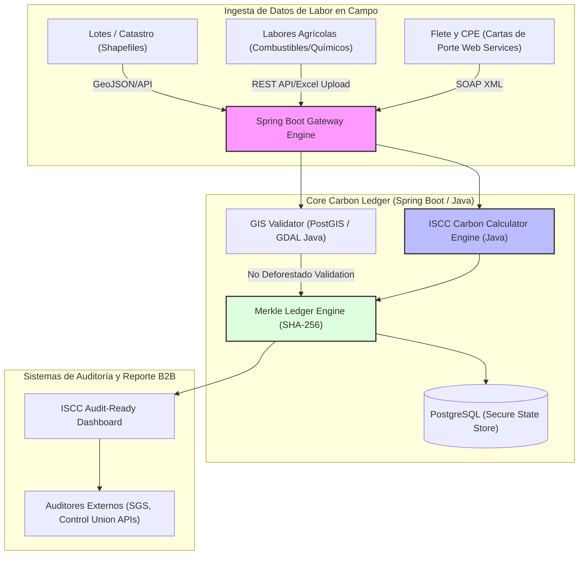

# Biocombustibles Carbon Ledger (Cadena de Custodia ISCC y Contabilidad de Carbono)

- **Fricción Monetizable:** Las plantas exportadoras de biocombustibles en Argentina (bioetanol de maíz y biodiésel de soja) están obligadas a certificar la reducción de Gases de Efecto Invernadero (GEI) de sus productos bajo el estándar internacional **ISCC 205 (Gases de Efecto Invernadero)** para no perder acceso al mercado europeo y mercados premium internacionales. Rastrear y auditar de forma inmutable las labores de campo (combustible de maquinaria, fitosanitarios aplicados) de miles de lotes independientes de terceros es inmanejable mediante planillas Excel, lo que genera retrasos críticos en las auditorías de certificación y riesgo de rechazo de exportaciones.

- **Moat Técnico:**
    - **Calculadora Analítica ISCC en Java:** Un motor de procesamiento matemático robusto implementado en **Java/Spring Boot** que traduzca dinámicamente las fórmulas de cálculo de emisiones de GEI dictadas por el estándar ISCC 205, adaptado a las matrices de insumos locales de Argentina.
    - **Inmutabilidad y Auditoría Forense:** Creación de un ledger de inmutabilidad transaccional utilizando almacenamiento inalterable (como Amazon QLDB o estructuras de datos Merkle Tree escritas nativamente en Java) para registrar la huella de carbono de cada lote de grano desde la balanza de acopio hasta su molienda industrial.
    - **Validación Satelital contra Deforestación (EUDR Link):** Integración de servicios de análisis geoespacial (GIS) que verifiquen las geometrías catastrales de los lotes de cultivo contra mapas satelitales históricos para autogarantizar el criterio de "no deforestación" dictado por la **EUDR** antes de calificar la mercadería.

### Esquema de Arquitectura

- **Análisis Escéptico:**
    1. **¿Es un problema de hoy?** Sí, las exigencias ambientales de Europa y mercados internacionales se han endurecido radicalmente en 2026. Una planta procesadora que no pueda certificar ágilmente sus emisiones GEI e inmutabilidad de cadena de custodia queda fuera de los contratos de exportación de mayor valor.
    2. **¿Pagarían por ello?** Las industrias aceiteras y de biocombustibles manejan volúmenes gigantescos de dinero y pagan con creces licencias SaaS corporativas premium porque el costo de perder una auditoría o demorar un despacho marítimo por inconsistencias documentales se mide en cientos de miles de dólares.
    3. **Moat de 3 Miopes:** El procesamiento y cálculo analítico de emisiones bajo fórmulas físicas internacionales, integrado con algoritmos de validación geoespacial sobre PostGIS y estructuras de datos inmutables en Java, es una obra de ingeniería de software avanzada. No puede ser clonado por desarrolladores junior o herramientas "no-code".
    4. **Fricción de salida:** La inmutabilidad de la cadena de custodia requiere almacenar de forma consecutiva la genealogía del grano. Cambiar de plataforma de software rompe la cadena histórica de inmutabilidad y arriesga la certificación ISCC vigente del exportador.
    5. **Escalabilidad:** Perfectamente aplicable al mercado de biomasa, bioqueroseno de aviación (SAF) y granos sustentables en toda América Latina (Brasil, Paraguay, Uruguay).

## Backlinks
*   Ver contexto de sustentabilidad global en [[Certificacion_Huella_Carbono_Biocombustibles]]
*   Ver integración con normativas europeas en [[Friccion EUDR]], [[EUDR_Compliance_Gateway]]
*   Ver zonas núcleo de adaptación tecnológica en [[Zonas Nucleo Adaptacion Tecnologica]]
