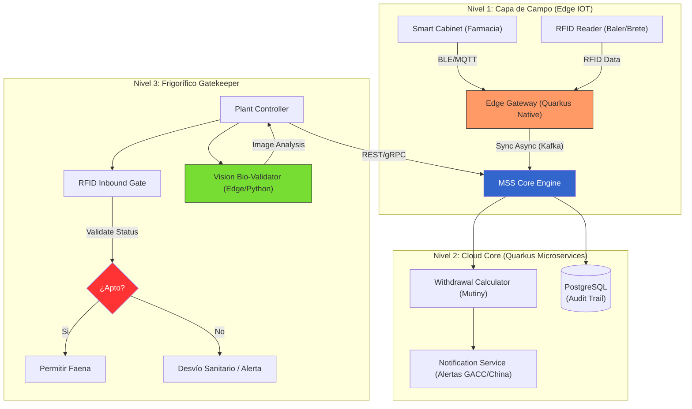

# Meat Sanitary Shield: SaaS de Trazabilidad Química de Insumos

- **Fricción Monetizable**: El caso **ArreBeef (Abril 2026)** demuestra que un error de un proveedor (aplicar cloranfenicol o no respetar tiempos de carencia) puede destruir la rentabilidad de un frigorífico exportador. El frigorífico no tiene forma de saber qué hay "dentro" del animal hasta que un puerto en China o la UE hace un testeo químico. Cada día de cierre de mercado cuesta millones. La oportunidad es un SaaS que desplace el control al origen y lo automatice para el frigorífico.

- **Moat Técnico**:
    1. **Receta Digital Interconectada**: Un motor en **Java/Quarkus** que sincronice las recetas de veterinarios privados con el sistema de stock de insumos del feedlot/campo.
    2. **Algoritmo de Tiempo de Carencia (Withdrawal Alert)**: Cruce de datos entre la fecha de aplicación, el principio activo y el peso del animal para emitir un "Semáforo Verde/Rojo" de despacho hacia el frigorífico.
    3. **Integración con Compras del Frigorífico**: El sistema de ArreBeef bloquea la emisión de la orden de compra si el CUIT del productor no tiene el "Apto Químico" validado digitalmente por un auditor externo o por telemetría IoT de bretes electrónicos.

---

## Arquitectura Técnica: Meat Sanitary Shield (MSS)

Para cumplir con el **Moat Técnico** de "3 Miopes", la arquitectura debe ser reactiva, resiliente y capaz de operar en entornos con conectividad intermitente (el campo).

### Stack Tecnológico
- **Core**: Java 21 + **Quarkus** (Reactive Stack con Mutiny).
- **Persistence**: PostgreSQL + **Hibernate Reactive** + TimescaleDB (para telemetría de biosensores).
- **Messaging**: Apache Kafka (Event Sourcing para cada tratamiento animal).
- **Edge**: Quarkus Native (ejecutándose en gateways industriales en bretes y farmacias).
- **Integración**: OpenAPI para conexión con SIGSA (SENASA) y SAP/ERP del frigorífico.

### Diagrama de Arquitectura

### Componentes Críticos
1. **Withdrawal Period Engine (WPE)**: Microservicio reactivo que calcula el tiempo de carencia dinámico basado en la curva de depuración del principio activo (ej: cloranfenicol, ivermectina) ajustado por el peso y metabolismo del animal reportado vía RFID.
2. **Double-Click Validation**: El sistema no solo confía en el registro manual. Cruza la compra de insumos (vía integración con agronomías) con el uso reportado. Si hay "desaparición de stock" sin reporte de uso, el lote entra en **Alerta Amarilla**.
3. **Módulo Bio-Vision (Validator)**:
    - **Hardware**: Cámaras hiperespectrales en la línea de faena.
    - **Software**: Modelo de Deep Learning entrenado para detectar "Injection Sites" (sitios de inyección) recientes o atípicos.
    - **Función**: Verifica físicamente si el animal recibió una inyección que no fue declarada en el SaaS de campo. Si encuentra un hematoma o marca de inyección en el cuarto trasero y el registro RFID dice "Sin tratamientos", detiene la línea para testeo químico inmediato.
4. **Inmutable Audit Trail**: Cada tratamiento genera un evento en Kafka que se persiste con un hash encadenado (similar a una blockchain liviana).

---

## Análisis Escéptico (Skeptic Shredding Mode)

1. **Idea central:** No vendes "Visión Artificial" ni "Salud"; vendes un **Seguro contra la Suspensión (Business Continuity)**. El comprador (ArreBeef) no quiere ver fracturas ni hematomas, quiere ver un "Escudo Legal" que pueda presentar ante la aduana China para decir: "Tengo tres capas de validación: Auditoría de Insumos, Trazabilidad RFID y Validación Biológica".

2. **Trade-offs:** 
    * **Ganas**: El control absoluto del riesgo sanitario.
    * **Sacrificas**: Velocidad y simplicidad. Instalar cámaras en una línea de 300 cabezas/hora implica que cualquier "falso positivo" del modelo de IA detiene la producción, costando miles de dólares por minuto. El trade-off es **Certeza vs. Throughput**.

3. **Riesgos críticos:**
    * **Hostilidad Ambiental (The Death Zone)**: Los frigoríficos son ambientes de vapor, sangre, grasa y humedad extrema. Las cámaras hiperespectrales son equipamiento delicado y costoso. El riesgo de falla de hardware antes de que el ROI sea positivo es altísimo (Technological Overkill).
    * **Ruido Biológico**: No todas las marcas en la carne son inyecciones de antibióticos. Golpes en el transporte o picaduras de insectos pueden generar "falsos positivos" que el software interpretará como inyecciones no declaradas, castigando injustamente al productor.
    * **El Eslabón de la Farmacia**: Si un productor "anestesia" su registro comprando el cloranfenicol en el mercado negro (fuera de las agronomías integradas), tu SaaS de campo queda ciego y la cámara es tu única y débil defensa.

4. **Efectos de segundo orden:** 
    * **Creación de "Carne de Segunda"**: Las reses rechazadas por el MSS se volcarán masivamente al mercado interno argentino, donde los controles son menores. Esto podría deprimir el precio local y crear una brecha sanitaria alarmante entre lo que exportamos y lo que comemos.
    * **Obsolescencia Human**: Los inspectores veterinarios actuales verán al sistema como una amenaza, lo que puede llevar a sabotajes operativos (lentes "sucios" por falta de limpieza mánual).

5. **Próximo movimiento recomendado:**
    * **Acción Específica**: No lances el módulo de visión como un "bloqueador automático".
    * **Paso 1 (Shadow Mode)**: Instalar las cámaras para recolectar datos durante 3 meses sin detener la línea, entrenando el modelo con los hallazgos de laboratorio real.
    * **Paso 2**: Integrar la IA como un "Asistente del Veterinario de Planta", no como un reemplazo.
    * **Paso 3**: Crear un "Fondo de Garantía" para los productores: si el sistema da un falso positivo, el productor es compensado.
