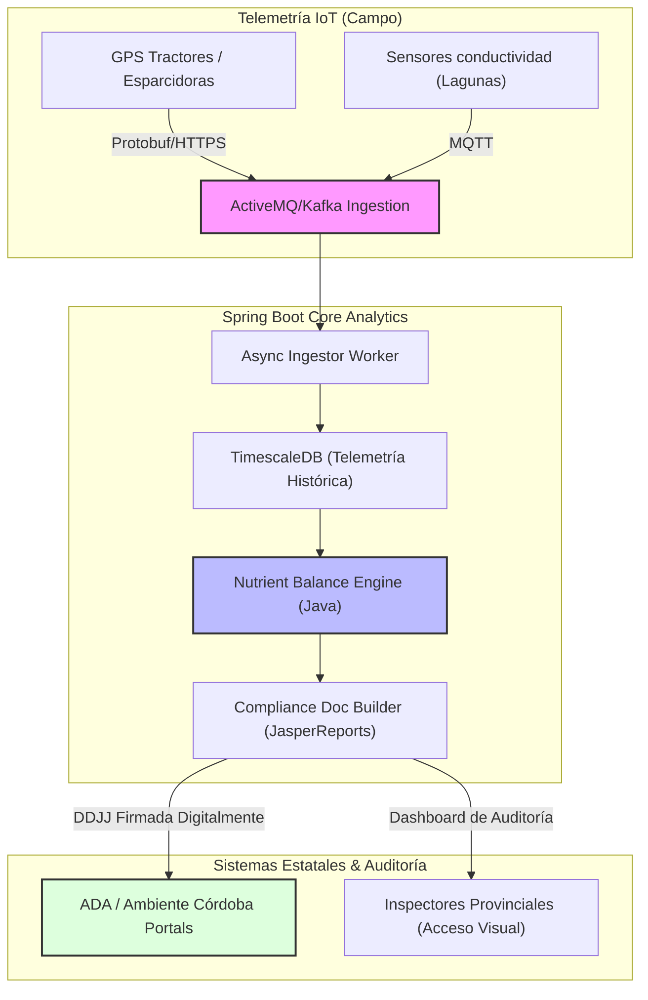

# Effluent Compliance Gateway (Plataforma de Esparcido de Purines e Informes ADA/Córdoba)

- **Fricción Monetizable:** Los establecimientos de engorde a corral (feedlots) y los mega-tambos en Buenos Aires, Córdoba y Santa Fe operan bajo una espada de Damocles regulatoria ambiental. La Autoridad del Agua (ADA) de Buenos Aires y la Secretaría de Ambiente de Córdoba exigen **Planes de Aplicación Agronómica** detallados para autorizar el uso de efluentes pecuarios como biofertilizantes. La sobredosis de purín daña el cultivo y contamina napas freáticas, derivando en multas millonarias y clausura operativa inmediata de plantas de faena o tambos industriales.

- **Moat Técnico:**
    - **Algoritmo de Absorción y Balance de Nutrientes:** Un motor analítico en **Java/Spring Boot** que compute la tasa de mineralización del nitrógeno orgánico del purín líquido basado en la conductividad eléctrica de la laguna y las variables climáticas locales, determinando la dosificación exacta de metros cúbicos por hectárea.
    - **Ingesta IoT e Integración GPS de Esparcidores:** Ingesta de datos de telemetría de esparcidores y sensores de tanques en tiempo real procesados asíncronamente con **Apache Kafka** y persistidos en una base de datos de series temporales (**TimescaleDB**).
    - **ADA & Córdoba PDF Auto-Compiler:** Compilación automatizada de la memoria técnica de aplicación del efluente firmada digitalmente, compatible con las plantillas de presentación obligatoria ante la ADA (Buenos Aires) y ambiente de Córdoba, ahorrando miles de dólares en consultoras ambientales.

### Esquema de Arquitectura

- **Análisis Escéptico:**
    1. **¿Es un problema de hoy?** Sí, las provincias están forzando a tambos y feedlots a migrar hacia el vuelco cero y el uso agronómico de estiércol para evitar la contaminación de napas en 2026.
    2. **¿Pagarían por ello?** Los feedlots y tambos grandes pagan con gusto una suscripción mensual para blindarse legalmente contra multas hídricas que superan los 100,000 USD y evitar la parálisis biológica de su establecimiento.
    3. **Moat de 3 Miopes:** La combinación de ingesta IoT masiva y geolocalizada en series temporales con modelos de simulación biológica de suelos en Java requiere ingenieros de datos y desarrolladores senior. Un simple CRUD desarrollado por programadores junior no puede modelar la tasa de degradación química del amonio en suelo en base a la temperatura del lote.
    4. **Fricción de salida:** El software resguarda el historial de vuelco y balance de nutrientes acumulados de los lotes del productor por años. Cambiar de proveedor de software implica perder el historial certificado de impacto ambiental indispensable para defenderse en futuras auditorías de ADA.
    5. **Escalabilidad:** Modelo adaptable al mercado de purines pecuarios en Brasil y Uruguay, que están implementando normativas ambientales análogas sobre efluentes porcinos y bovinos.

## Backlinks
*   Ver marco regulatorio en [[Uso_Agronomico_Efluentes_Pecuarios]]
*   Ver dolores operativos en [[Pyme Lactea Santafesina Crisis]], [[Sancor]], [[Biofarma]]
