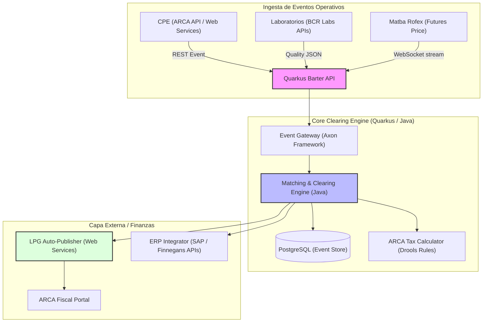

# Enterprise Barter Engine (Clearing Automatizado de Canje de Granos)

- **Fricción Monetizable:** El **Canje de Granos (Barter)** representa el canal de financiación e intercambio comercial de insumos más grande de Argentina. Sin embargo, su procesamiento manual es una pesadilla burocrática y fiscal. Vincular contratos de compraventa de insumos con las Liquidaciones Primarias de Granos (LPG), conciliar el peso de balanza de decenas de camiones contra un solo contrato, y deducir correctamente los regímenes cambiantes de retenciones de IVA/Ganancias de ARCA toma semanas de labor administrativa. En una economía volátil, esta demora de semanas expone a los distribuidores a un riesgo cambiario devastador.

- **Moat Técnico:**
    - **Fintech Clearing Engine en Quarkus:** Un motor transaccional de alto rendimiento que ejecute la conciliación cruzada automática entre Cartas de Porte Electrónicas (CPE), balanzas de acopio (IoT), análisis de calidad cerealera en tiempo real (**BCR Labs**) y el contrato comercial.
    - **APIs de Matba Rofex Integration:** Un pipeline de procesamiento de cotizaciones financieras que automatice las coberturas de cambio (hedging) en mercados de futuros en el milisegundo en que se valida el peso de descarga del camión.
    - **Event Sourcing (Axon Framework):** Uso de arquitectura orientada a eventos para registrar un historial de auditoría inmutable de todas las liquidaciones financieras y de grano, asegurando trazabilidad contable absoluta requerida por entes reguladores internacionales y bancos de inversión.

### Esquema de Arquitectura

- **Análisis Escéptico:**
    1. **¿Es un problema de hoy?** Sí, el canje de granos representa más del 50% de las ventas de insumos. Con la inflación y devaluación cambiaria constante en Argentina, el tiempo de liquidación de un canje equivale a pérdida directa de capital de trabajo.
    2. **¿Pagarían por ello?** Las cooperativas agrícolas y grandes distribuidoras (que manejan miles de transacciones de canje por campaña) pagan de inmediato una suscripción SaaS por la optimización fiscal (ahorro en retenciones de IVA) y la reducción del riesgo cambiario gracias a la liquidación acelerada.
    3. **Moat de 3 Miopes:** La conciliación multivariable en tiempo real, el cálculo dinámico de retenciones impositivas de ARCA bajo Drools, y la arquitectura transaccional de Event Sourcing con Axon Framework no son habilidades que un desarrollador miope pueda codificar en un mes. Requiere una arquitectura backend empresarial sumamente sólida y testeada.
    4. **Fricción de salida:** La plataforma actúa como la contabilidad paralela y el ledger transaccional del distribuidor de insumos. Cambiar de proveedor requiere migrar millones de eventos y registros históricos de deudas conciliadas en grano, haciendo que la retención de clientes sea altísima.
    5. **Escalabilidad:** Aplicable a modelos de trueque granario y barter en Brasil (donde el canje es también la principal herramienta financiera de compra de insumos de soja).

## Backlinks
*   Ver contexto financiero en [[Conciliacion_Canje_Granos]]
*   Ver actores del mercado cerealero: [[BCR Labs]], [[Consorcio de Frigorificos ABC]], [[Sancor]]
