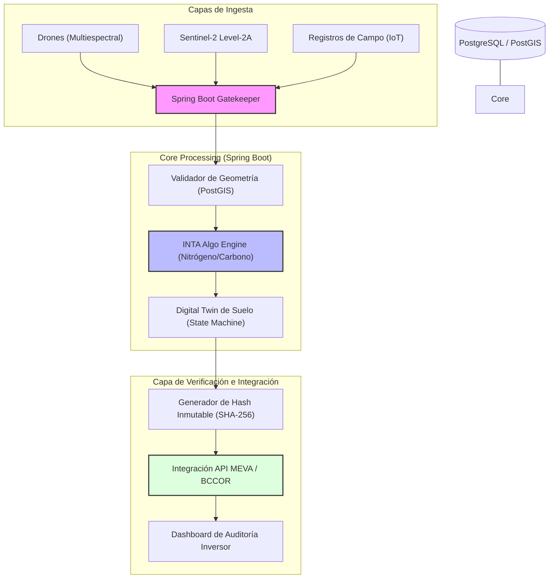

# SaaS de Verificación (MRV) para el Mercado de Valores Ambientales (MEVA)

- **Fricción Monetizable**: El recién lanzado **MEVA** en Córdoba ha realizado su primera operación, pero el proceso de validación de "créditos" (Carbono, Agua, Biodiversidad) sigue siendo manual, costoso y propenso al *greenwashing*. Sin una verificación auditable y en tiempo real, el valor de estos créditos se desploma. Los productores necesitan certificar su captura de carbono para vender en este nuevo mercado, pero no tienen las herramientas técnicas.

- **Moat Técnico**: 
    - **Integración de Algoritmos INTA**: Implementar un motor de procesamiento en **Java/Spring Boot** que integre los modelos de INTA Reconquista para el ajuste de fertilización nitrogenada vía imágenes multiespectrales de drones.
    - **Orquestación de Datos Satelitales**: No solo drones, sino un motor que cruce datos de Sentinel-2 con registros de campo para generar un "Digital Twin" del suelo que verifique la reducción real de N2O (Óxido Nitroso), vinculándolo automáticamente a un registro inmutable.
    - **Certificado Inmutable**: Generar una firma digital por cada parcela verificada, asegurando que el crédito ambiental no se venda dos veces (double counting).

### Esquema de Arquitectura (Borrador)

- **Análisis Escéptico**: 
    1. **¿Es un problema de hoy?**: Sí, MEVA ya está operativo y la primera operación es el "trigger" de adopción.
    2. **¿Pagarían por ello?**: Las empresas que compran créditos para compensar huella necesitan la auditoría para sus reportes de sustentabilidad corporativos. El productor paga para "desbloquear" el valor de su campo.
    3. **Moat de 3 Miopes**: Implementar los algoritmos de INTA y cruzarlos con telemetría de drones de forma escalable requiere una arquitectura de microservicios robusta en **Java/Spring Boot**, no es un simple script de Python para visualización.
    4. **Fricción de salida**: Una vez que el historial de créditos de un campo está en esta plataforma, cambiar a otra implica perder la trazabilidad histórica de regeneración de suelos.
    5. **Escalabilidad**: El modelo es replicable a cualquier mercado biocarbono global, pero el anclaje en Córdoba con la Bolsa de Cereales da el *first-mover advantage*.
