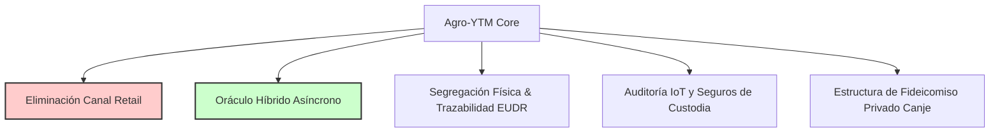

# Pre-Mortem: Agro-YTM (Tokenización de Liquidez Agropecuaria)

> **Clasificación:** Análisis Forense Prospectivo de Riesgos Críticos en State-Functions-as-a-Service (SFaaS).  
> **Metodología:** Gary Klein & Daniel Kahneman (Red Team simulado a 18 meses).  
> **Tono:** Escéptico, analítico, pragmático y contextualizado en la realidad regulatoria y operativa de la República Argentina.

---

## FASE 0 — RADIOGRAFÍA PREVIA

* **Tesis central:** Creación de un sistema de tokenización de liquidez agropecuaria (Agro-YTM) desarrollado en backend Java/Spring Boot/Web3j, colateralizado mediante warrants digitales de granos y ganado trazado por RFID (Bajo Res. 841/2025), permitiendo swaps instantáneos a pesos para resolver las pérdidas por liquidez del productor contra fondos *money market* locales.
* **Vectores de Fricción SFaaS activados:**
  * **Vector 1: Integración Técnica (Integration-as-a-Service):** Dependencia crítica y en tiempo real de APIs estatales para la validación de propiedad y estado del colateral (ARCA CPE/LPG y SENASA SIGSA/DT-e).
  * **Vector 3: Arbitraje y Confianza (Arbitration-as-a-Service):** Uso de warrants emitidos por acopios privados e integración con oráculos de la Bolsa de Comercio de Rosario (MATba-ROFEX) como sustitutos de la validación física estatal.
* **Vectores de Fricción SFaaS ignorados (Puntos ciegos):**
  * **Vector 6: Desacople Físico-Digital (LETAL):** Suposición de que el colateral digitalizado por caravanas RFID o certificados de depósito mantiene su correlación física 1:1 de forma estática en el campo o silo, ignorando mermas de grano, vandalismo de silos, abigeato y fallas operativas de lectura de caravanas RFID.
  * **Vector 4: Asimetría Algorítmica:** Ausencia de modelado para el riesgo de retenciones dinámicas de ARCA y bloqueos discrecionales ex-post de Cartas de Porte Electrónicas (CPE), las cuales inmovilizan los subyacentes del token instantáneamente sin previo aviso.
* **Supuestos ocultos:**
  1. *Aceptación incondicional del token:* Se asume que las agronomías y proveedores de insumos aceptarán voluntariamente un token colateralizado por commodities como medio de pago para transacciones de capital de trabajo diario, absorbiendo ellos el riesgo cambiario/base.
  2. *Infalibilidad del marco de desregulación RFID:* Se asume que la flexibilización de la identificación individual bovina (Res. 841/2025) será estable en el tiempo y no sufrirá retrocesos corporativistas o técnicos por parte de SENASA.
  3. *Inmutabilidad y liquidez del subyacente:* Se asume que los acopios emisores de warrants y los feedlots mantendrán la custodia física en óptimas condiciones, ignorando el dolo o la insolvencia de los custodios del colateral.
* **Modelo B2B o B2C Check (Riesgo Crítico):** El plan original contempla al **"Inversor Retail"** como parte de su target. 
  > [!CAUTION]
  > **RIESGO LETAL DIRECTO:** La inclusión de inversores minoristas (retail) rompe la regla de oro de la tesis SFaaS. Abre de forma inmediata el escrutinio de la Comisión Nacional de Valores (CNV) por intermediación financiera no autorizada e intermediación en oferta pública de securities no registrados. Esto eleva los costos de cumplimiento y el riesgo legal a un nivel que destruye cualquier viabilidad operativa. **El target debe restringirse exclusivamente a actores corporativos en base USD/canje.**

---

## FASE 1 — EL ESCENARIO CATASTRÓFICO (Noviembre 2027)

Es 25 de noviembre de 2027. **Agro-YTM ha colapsado de manera estrepitosa e irreversible.** El token cotiza a cero en los mercados secundarios y el pool de liquidez en pesos está totalmente vaciado y embargado. El churn de las agronomías piloto es del 100% y los productores líderes de la Zona Núcleo han iniciado demandas colectivas penales por estafa y retención indebida de granos. 

La Comisión Nacional de Valores (CNV) ha emitido una orden de cese inmediato de actividades a la plataforma por operar una "oferta pública de títulos de deuda no autorizada", mientras que la ex-AFIP (ARCA) reclama millones en concepto de evasión de Impuesto a los Débitos y Créditos Bancarios por transacciones simuladas bajo la forma de permuta de granos. El equipo técnico senior backend se ha desintegrado ante la imposibilidad de conciliar en Java las discrepancias entre los registros de blockchain (Web3j) y la realidad física de los campos y acopios inundados o vacíos de la campaña.

---

## FASE 2 — PANEL DE FORENSES

Para destripar sistemáticamente este desastre, convocamos a cinco especialistas forenses especializados en el ecosistema AgTech e impositivo argentino:

### 1. El Regulador Fantasma: Dra. Silvina Mantegazza
* **Perfil:** Ex-jefa de Asuntos Legales de la CNV y experta en estructuración de fideicomisos agrícolas y derecho tributario.
* **Idoneidad:** Analiza la letalidad de categorizar el token como un título valor ("security") y cómo ARCA destruyó el arbitraje impositivo a través de retenciones de oficio.

### 2. El Operador de Trinchera: Ing. Agr. Bautista "Tito" Zubiaurre
* **Perfil:** Administrador de 15,000 hectáreas en la Zona Núcleo y director del Acopio "Don Bautista" en Necochea.
* **Idoneidad:** Evaluará el comportamiento del colateral físico real (grano en silos-bolsa con picaduras de peludos, mortandad de ganado y pérdida de conectividad en el corral de pesaje).

### 3. El Escéptico Financiero: Juan Cruz Solá
* **Perfil:** Managing Partner de Pampas Ventures, con 12 años fondeando AgTechs en el cono sur.
* **Idoneidad:** Desarmará las falacias de los unit economics, el flujo del swap de liquidez y por qué el productor prefiere el dólar MEP o el e-cheq antes que un token sintético no líquido.

### 4. El Ingeniero de Sistemas: Ing. Martín "Polaco" Krawczyk
* **Perfil:** Arquitecto de software backend senior Java/Spring, ex-desarrollador de la infraestructura transaccional de Matba-Rofex.
* **Idoneidad:** Evaluará el rendimiento de Web3j en infraestructuras rurales inestables y la fragilidad del oráculo conectado a APIs públicas del Estado que retornan códigos HTTP 504.

### 5. El Geopolítico Frío: Dr. Federico Larreta
* **Perfil:** Ex-Director de Cumplimiento de una de las Big Four cerealeras del Up-River (Rosario).
* **Idoneidad:** Diseccionará por qué los exportadores líderes rechazaron el token debido a las severas exigencias de trazabilidad de la directiva europea contra la deforestación (EUDR) y normas de compliance global.

---

## FASE 3 — HISTORIAS DEL DESASTRE FORENSE

### 1. El Regulador Fantasma (Dra. Silvina Mantegazza)
> [!NOTE]
> *“El laberinto del título valor y la voracidad fiscal de ARCA.”*
* **El Detalle Fatal Ignorado:** La ingenuidad de creer que un token respaldado por warrants o hacienda RFID se consideraría una simple "permuta mercantil" exenta del escrutinio de la CNV y libre de impuestos transaccionales.
* **La Cadena Causal:** En el mes 3, para atraer volumen, se abrió la plataforma a "Inversores Retail" prometiéndoles rendimientos agropecuarios estables en pesos. En el mes 6, la CNV catalogó a Agro-YTM como una oferta pública irregular de títulos de crédito bajo la Ley de Mercado de Capitales. Al mismo tiempo, ARCA dictaminó que cada swap del token por pesos no constituía un "canje agropecuario" (que goza de exenciones), sino una permuta financiera gravada con el impuesto al cheque y sujeta a retenciones automáticas de IVA y Ganancias del 15% ex-post. La plataforma tuvo que absorber las retenciones para evitar el éxodo de productores, evaporando el margen de ganancia en el mes 9.
* **Veredicto del Vector:** **Vector 4: Asimetría Algorítmica.** Las reglas impositivas argentinas actuaron como una caja negra ex-post, destruyendo los unit economics del proyecto de la noche a la mañana.

### 2. El Operador de Trinchera (Ing. Agr. Bautista Zubiaurre)
> [!NOTE]
> *“El barro físico contra el bit y el fraude de la hacienda fantasma.”*
* **El Detalle Fatal Ignorado:** Suponer que una caravana RFID electrónica del SENASA colocada en la oreja de un novillo garantiza la existencia e inmutabilidad del colateral sin auditoría de campo presencial.
* **La Cadena Causal:** En el mes 8, el sistema tokenizó 2,000 cabezas de ganado de un mega-feedlot en Santiago del Estero. En el mes 11, una sequía extrema combinada con un brote sanitario diezmó el 30% del plantel físico. Los operadores del feedlot, desesperados por mantener el margen, no reportaron las bajas a la plataforma y mantuvieron los registros RFID activos clonando o reasignando caravanas de animales muertos a animales sanos de campos vecinos. Cuando un tenedor del token de Agro-YTM intentó liquidar físicamente su colateral para cobrar en el mes 14, se encontró con corrales vacíos y un faltante físico insalvable. El sistema no tenía forma de auditar el fraude digitalmente.
* **Veredicto del Vector:** **Vector 6: Desacople Físico-Digital (LETAL).** El colapso del colateral físico real en el campo quebró la confianza del ecosistema y desató las demandas criminales.

### 3. El Escéptico Financiero (Juan Cruz Solá)
> [!NOTE]
> *“La trampa de liquidez en pesos y la falacia del canal minorista.”*
* **El Detalle Fatal Ignorado:** Intentar competir con las herramientas tradicionales de financiamiento agrícola (como el Canje de Granos directo con agronomías y los e-cheqs avalados por SGRs a tasas subsidiadas).
* **La Cadena Causal:** En el mes 4, la plataforma descubrió que las agronomías grandes se negaban a aceptar el token como pago directo de agroquímicos porque necesitaban calzar sus propias deudas en USD billete con las multinacionales de insumos. Obligaron a la plataforma a actuar como único market maker, garantizando swaps instantáneos a pesos. En el mes 10, ante una corrida cambiaria y ensanchamiento de la brecha del dólar en Argentina, todos los productores decidieron liquidar en masa sus tokens Agro-YTM para dolarizarse vía MEP. La plataforma se quedó sin liquidez en pesos en menos de 48 horas, forzando la venta apresurada y con descuento de los granos físicos subyacentes, asumiendo una pérdida catastrófica de capital.
* **Veredicto del Vector:** **Modelo B2B/B2C Violado.** La inclusión del inversor retail creó un pasivo de liquidez a la vista que el colateral ilíquido agrícola no pudo respaldar durante una corrida cambiaria.

### 4. El Ingeniero de Sistemas (Ing. Martín Krawczyk)
> [!NOTE]
> *“La latencia del oráculo en Zona Núcleo y el colapso del middleware de SENASA.”*
* **El Detalle Fatal Ignorado:** Construir un motor de liquidación en Spring Boot dependiente de llamadas síncronas a las APIs públicas de SENASA (SIGSA) para validar la trazabilidad del ganado.
* **La Cadena Causal:** Las APIs de SENASA sufren caídas de hasta 12 horas seguidas y bloqueos por mantenimiento sin previo aviso los fines de semana. Durante el mes 7, en plena cosecha gruesa, la caída continuada del backend estatal impidió procesar los swaps automáticos y las liberaciones de warrants en la blockchain privada (vía Web3j). Los productores sufrieron demoras de más de 24 horas para liberar camiones en los puertos porque el sistema no podía certificar la validez del colateral digitalizado. Esto generó sobrecostos de flete y multas portuarias que superaron el valor del rendimiento financiero del token.
* **Veredicto del Vector:** **Vector 1: Integración Técnica.** El middleware no contemplaba un estado de contingencia asíncrono para operar offline ante la caída del "Estado de Datos".

### 5. El Geopolítico Frío (Dr. Federico Larreta)
> [!NOTE]
> *“La barrera invisible de la Unión Europea y el compliance de las cerealeras.”*
* **El Detalle Fatal Ignorado:** Creer que las grandes cerealeras exportadoras del Up-River (Rosario) aceptarían granos tokenizados sin un estricto flujo de procedencia física que garantizase el cumplimiento de la normativa EUDR (Deforestación Cero).
* **La Cadena Causal:** A partir del mes 12, con la entrada en vigencia estricta de las normas de exportación europeas, las terminales portuarias exigieron georreferenciación parcelaria y trazabilidad total del grano desde el lote de origen. El token Agro-YTM, al mutualizar y mezclar warrants de múltiples acopios para dar liquidez al pool secundario, destruyó la trazabilidad de origen del grano físico ("fungibilidad total"). Las cerealeras de primera línea (Cargill, Bunge, Cofco) rechazaron comprar el grano colateralizado por Agro-YTM por riesgo de contaminación de lotes no certificados. El subyacente de la plataforma quedó relegado al mercado interno con un descuento de precio del 25%, rompiendo la paridad del token.
* **Veredicto del Vector:** **Vector 5: Desprotección Geopolítica.** Ignorar que los mercados internacionales exigen segregación física, no tokenización digital fungible.

---

## FASE 4 — ANTÍDOTO TÁCTICO Y MAPA DE RIESGOS

### A. Los 3 Vectores de Riesgo Macro

1. **Riesgo de Regulación y Off-chain Compliance (CNV / ARCA):**
   * **Probabilidad:** ALTA. La CNV y ARCA actúan de oficio ante cualquier emisión de tokens liquidados en moneda local que simule intermediación financiera.
   * **Horizonte:** 3 - 6 meses desde el lanzamiento de la fase beta.
   * **Vector SFaaS Comprometido:** *Vector 4: Asimetría Algorítmica* e *Incumplimiento de la Regla B2B*.
2. **Riesgo de Desacople Físico por Fraude o Merma (Custodia de Colateral):**
   * **Probabilidad:** ALTA. El agro argentino opera con altos niveles de informalidad y riesgos climáticos/operativos en el almacenamiento físico en origen (silos-bolsa).
   * **Horizonte:** 9 - 12 meses (primer ciclo de cosecha completo).
   * **Vector SFaaS Comprometido:** *Vector 6: Desacople Físico-Digital*.
3. **Riesgo de Inestabilidad en la Infraestructura Estatal de Datos:**
   * **Probabilidad:** MEDIA-ALTA. SENASA y ARCA no garantizan SLAs sobre sus APIs de control de hacienda y transporte de granos.
   * **Horizonte:** Inmediato (desde el día 1 de integración técnica).
   * **Vector SFaaS Comprometido:** *Vector 1: Integración Técnica*.

---

### B. Ajustes Arquitectónicos Obligatorios (Soldaduras de Fortificación)

Para que este proyecto pueda sobrevivir, se deben soldar de forma proactiva las siguientes 5 modificaciones de diseño a la arquitectura backend y comercial:

1. **Eliminación Total del Canal Retail (B2B Estricto):**
   * *Intervención:* Modificar los términos y condiciones de la plataforma y el middleware en Spring Security para limitar el onboarding únicamente a personas jurídicas categorizadas como Productores Agropecuarios Grandes o Empresas de Insumos con facturación auditada, operando mediante contratos privados de canje.
   * *Costo/Tiempo:* Bajo (2 semanas de desarrollo y rediseño de UI/UX de onboarding).
   * *Riesgo Mitigado:* Elimina el riesgo de intervención de la CNV por oferta pública y simplifica radicalmente las obligaciones fiscales de retención de ARCA.
2. **Implementación de Oráculo Híbrido Asíncrono y Tolerancia a Fallos (Fault Tolerance):**
   * *Intervención:* Modificar el módulo Java backend de integración con APIs de ARCA/SENASA. Implementar un patrón de arquitectura *Circuit Breaker* (usando Resilience4j) y colas de mensegería (RabbitMQ/Kafka) que mantengan un estado transaccional "offline temporal" avalado por un Consorcio de Acopios en caso de caída de los servidores del Estado.
   * *Costo/Tiempo:* Medio (4 - 6 semanas de arquitectura backend y desarrollo de colas de contingencia).
   * *Riesgo Mitigado:* Previene paralizaciones operativas en puertos y cuellos de botella logísticos cuando colapsen las APIs de SENASA.
3. **Integración de Auditoría IoT y Seguros de Custodia sobre Silos/Hacienda:**
   * *Intervención:* No emitir ningún token contra caravanas RFID simples. Exigir que el ganado esté alojado en feedlots con sensores de pesaje automáticos y cámaras perimetrales con visión computacional integradas al backend. Para granos, los warrants deben ser validados por firmas de inspección internacional de primer nivel (ej. SGS, Control Union) y respaldados por una póliza de seguro de caución contra mermas físicas contratada en origen.
   * *Costo/Tiempo:* Alto (Inversión en hardware IoT y negociación de pólizas con aseguradoras líderes. Tiempo: 3 meses).
   * *Riesgo Mitigado:* Neutraliza el desacople físico-digital, la muerte biológica del colateral y el fraude por clonación de caravanas.
4. **Segregación Física del Colateral y Certificación de Origen Georreferenciado (EUDR Ready):**
   * *Intervención:* El backend en Java/Web3j debe registrar en la metadata del token no solo la cantidad de toneladas de granos, sino los polígonos GPS de origen del cultivo y su estatus de libre de deforestación. El pool de tokens se dividirá en subclases (ej. "Token EUDR Premium" para exportadores y "Token Standard" para mercado interno).
   * *Costo/Tiempo:* Medio-Alto (Desarrollo del motor de mapeo geoespacial en Spring Boot e integración con mapas satelitales. Tiempo: 2 meses).
   * *Riesgo Mitigado:* Evita el descuento forzado de precio del grano al permitir que las cerealeras exportadoras adquieran el subyacente para el mercado europeo sin violar normas de cumplimiento.
5. **Estructura Legal basada en Fideicomiso Privado de Canje (Escudo Fiscal):**
   * *Intervención:* Reemplazar el flujo de "tokenización y swap directo" por la suscripción digital de cuotapartes de un Fideicomiso Financiero Privado de Canje Agropecuario. Las transacciones en la plataforma serán tratadas legalmente como transferencias de derechos de cobro de canjes futuros de mercadería física, blindando la operación ante el impuesto al cheque de ARCA.
   * *Costo/Tiempo:* Alto (Costos de estructuración legal y rediseño de contratos inteligentes en Web3j. Tiempo: 2 meses).
   * *Riesgo Mitigado:* Elimina el latigazo fiscal de ARCA sobre permutas financieras simuladas.

---

### C. Veredicto Final

⚠️ **REQUIERE REDISEÑO FUNDAMENTAL**

**Justificación:** La tesis original de Agro-YTM posee un valor estratégico enorme ante la inflación y la brecha cambiaria del agro argentino, pero su arquitectura actual es **operativa e impositivamente inviable**. La inclusión de inversores minoristas (retail) es una sentencia de muerte regulatoria decretada por la CNV. Asimismo, el plan subestima críticamente el desacople físico-digital inherente al control de hacienda viva y el almacenamiento informal de granos. 

El proyecto solo debe financiarse y desarrollarse si se refacciona de inmediato hacia un modelo **estrictamente B2B corporativo**, blindado por seguros de caución físicos en origen, segregación de trazabilidad EUDR y estructurado legalmente bajo un Fideicomiso Privado de Canje Agropecuario que resista los embates fiscales del regulador de turno.

---
*Fin del Reporte Forense Prospectivo.*
