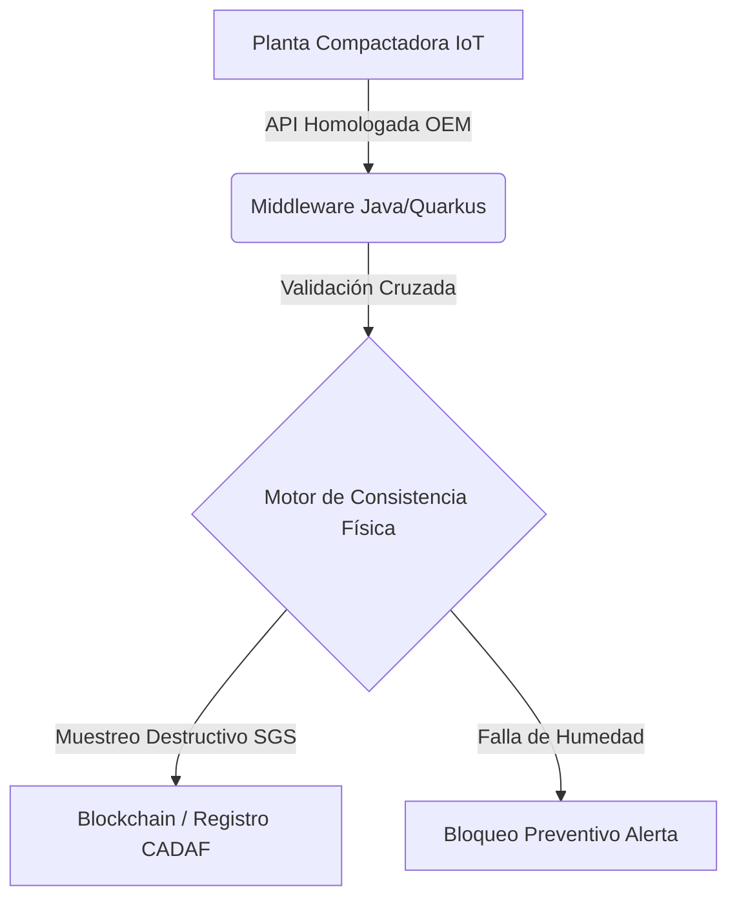

# Pre-Mortem: Alfalfa Export Traceability & Quality Compliance (AETQC)
> **Asociado a:** [[Alfalfa_Traceability_Compliance]]  
> **Metodología:** Análisis Forense Prospectivo SFaaS (State-Functions-as-a-Service)  
> **Fecha de Autopsia:** 2026-05-25  

---

## FASE 0: Radiografía previa

* **Tesis central del plan:**  
  Implementar un ecosistema digital SFaaS de trazabilidad y certificación de calidad algorítmica automatizada para la exportación de alfalfa en el Clúster de Córdoba (centrado en CADAF, San Francisco), capturando telemetría IoT de prensas compactadoras para mitigar rechazos en mercados premium del Golfo Pérsico.

* **Vectores de Fricción activados:**  
  1. **Arbitraje y Confianza (Vector 3 - Primario):** Reemplazo de la ineficiente validación oficial con un sistema de certificación privado digital ("trustless") de grado y estándares (humedad y proteína) mediante telemetría IoT.  
  2. **Integración Técnica (Vector 1):** Conexión del motor algorítmico Java (Quarkus) con las APIs del clúster exportador (CADAF) y sensores propietarios de compactado.  
  3. **Desprotección Geopolítica (Vector 5):** Defensa técnica ante las exigencias fitosanitarias y de calidad comercial impuestas por los importadores árabes (Arabia Saudita, Emiratos Árabes Unidos) sin soporte técnico del Estado.

* **Vectores ignorados:**  
  1. **Desacople Físico-Digital (Vector 6 - Punto Ciego Crítico):** El heno es un material biológico altamente higroscópico. La telemetría capturada en la prensa en San Francisco diverge violentamente del estado físico real del material tras cruzar 400 km de rutas deterioradas y semanas de tránsito en contenedores marítimos sin atmósfera controlada.  
  2. **Asimetría Algorítmica (Vector 4):** La desconexión con las reglas discrecionales de SENASA (bloqueos fitosanitarios ex-post) y ARCA (bloqueo preventivo de Cartas de Porte para subproductos forrajeros) anula la fluidez de los contratos.

* **Supuestos ocultos:**  
  1. **Supuesto de Apertura IoT:** Se asume que los fabricantes internacionales de prensas compactadoras (como Krone o McHale) y las plantas locales de densificado facilitarán APIs abiertas o permitirán la instalación de telemetría de terceros en sus ordenadores de abordo sin invalidar garantías.  
  2. **Supuesto de Aceptación Soberana del Comprador:** Se asume que los jeques y traders de Medio Oriente validarán un "token/certificado digital" emitido por una startup AgTech santafesina/cordobesa en lugar de guiarse estrictamente por los dictámenes tradicionales de certificadoras físicas multinacionales (SGS, Cotecna).  
  3. **Supuesto de Homogeneidad Física:** Se da por sentado que los productores del Clúster no realizarán adulteración física oportunista (ej. encubrir rollos húmedos o malezas en el interior de fardos supercompactados) que burle la telemetría superficial de la prensa.

* **Modelo B2B/B2C check:**  
  El target directo es CADAF y exportadores premium de San Francisco (B2B Corporativo, transaccionando en USD). Sin embargo, el modelo posee un eslabón débil indirecto: los pequeños y medianos productores del clúster cordobés que proveen la materia prima. Si estos últimos no pueden costear ni operar los sensores primarios, la cadena de trazabilidad se rompe en el origen.

---

## FASE 1: El escenario catastrófico (Noviembre 2027 — 18 meses en el futuro)

**Ubicación temporal:** 25 de noviembre de 2027.  
El proyecto de la plataforma AETQC ha colapsado de manera irreversible. El churn corporativo de CADAF es del 100%, el equipo técnico de desarrollo en Quarkus ha sido desmantelado y las pérdidas de capital superan los USD 350.000 en hardware IoT inservible y horas de ingeniería perdidas. La reputación del Clúster de Alfalfa Córdoba quedó severamente dañada ante los compradores del puerto de Jeddah (Arabia Saudita) tras múltiples rechazos de contenedores por pudrición bacteriana interna que el algoritmo de calidad catalogó como "Grado Premium". El comité forense se reúne para determinar las causas exactas de este desastre técnico y comercial.

---

## FASE 2: Panel de forenses

1. **El Regulador Fantasma:** Experto en derecho administrativo agropecuario. Convocado porque el proyecto pretendía esquivar la ineficiencia de SENASA, pero ignoró cómo los cambios regulatorios silenciosos en el control fitosanitario de forrajes pueden asfixiar la logística de exportación.
2. **El Operador de Trinchera:** Administrador del centro de compactación de CADAF en San Francisco. Convocado porque entiende la hostilidad física del polvo de alfalfa, las vibraciones extremas de las prensas hidráulicas de 400 toneladas y la bajísima confiabilidad de la conectividad en galpones rurales de chapa.
3. **El Escéptico Financiero:** VC enfocado en AgTech Latam. Convocado para desarmar la estructura de costos de los sensores IoT y evaluar por qué fallaron los unit economics cuando el precio internacional de la alfalfa cayó en 2027 y estranguló los márgenes del clúster.
4. **El Ingeniero de Sistemas:** Arquitecto backend Java/Quarkus e integrador industrial. Convocado para diseccionar la inviabilidad de leer la telemetría propietaria en tiempo real bajo protocolos CAN bus encriptados por los fabricantes de maquinaria pesada.
5. **El Geopolítico Frío:** Director de cumplimiento aduanero de una multinacional exportadora de granos. Convocado para analizar la psicología de los compradores de Medio Oriente y por qué un "certificado digital de confianza" de una startup privada fue ignorado frente a los arbitrajes tradicionales de puertos árabes.

---

## FASE 3: Historias del desastre forense

### 1. El veredicto del Regulador Fantasma
> *«La trampa de la Res. 841 y el vacío fitosanitario aduanero.»*  
> [ESPECULACIÓN] El equipo asumió que la simplificación regulatoria de 2025 les daría pista libre permanente.
* **El Detalle Fatal Ignorado:** Se consideró que la desregulación de aduanas permitía que un estándar privado dictara la salida de la mercadería, asumiendo que SENASA no intervendría si el lote contaba con trazabilidad certificada por CADAF.
* **La Cadena Causal:** En julio de 2026, ante denuncias de introducción de plagas cuarentenarias (ej. semillas de cuscuta) en cargamentos argentinos en los puertos de destino, SENASA endureció ex-post las exigencias físicas de inspección en planta para exportaciones de forrajes. El sistema digital AETQC no tenía forma de capturar este análisis microbiológico de laboratorio oficial mediante telemetría de prensa. SENASA bloqueó sistemáticamente las Cartas de Porte de exportación en origen para lotes validados por la app. La plataforma continuaba emitiendo certificados "Aptos" que en el plano aduanero eran ilegales. CADAF tuvo que desactivar el software para no duplicar los procesos de validación de manera manual.
* **El Veredicto del Vector:** **Arbitraje y Confianza (Vector 3).** El plan falló al intentar sustituir digitalmente al regulador sin un canal de interoperabilidad oficial que sincronizara los bloqueos fitosanitarios en tiempo real.

### 2. El veredicto del Operador de Trinchera
> *«El barro, el polvo de sílice y la termodinámica del fardo compacto.»*  
> [ESPECULACIÓN] Los ingenieros de software creyeron que una planta de compactado de alfalfa en San Francisco es un entorno limpio controlado comparable a una fábrica automotriz.
* **El Detalle Fatal Ignorado:** La alfalfa de zona núcleo ingresa a planta con altísima heterogeneidad física. La humedad medida externamente no refleja el "corazón" del megafardo de 800 kg compactado a presiones extremas de 400 kg/cm².
* **La Cadena Causal:** Durante la campaña de finales de 2026, los sensores infrarrojos e inductivos instalados en las prensas de CADAF se cubrieron rápidamente de polvo abrasivo y partículas suspendidas de sílice de la alfalfa, descalibrando las lecturas de humedad en menos de 48 horas de operación. Los operarios, presionados por los turnos de despacho de 90.000 toneladas, dejaron de limpiar los sensores. El sistema continuó procesando datos corruptos. [ESPECULACIÓN] Fardos con más de 18% de humedad residual interna (fermentación latente) fueron catalogados como "Premium 12%". Al sellarse los contenedores metálicos expuestos al sol del puerto de Rosario, la alfalfa fermentó, se quemó internamente y llegó a Arabia Saudita convertida en carbón vegetal y hongos. Churn inmediato.
* **El Veredicto del Vector:** **Desacople Físico-Digital (Vector 6).** Colapso absoluto por la inhabilidad del hardware y los algoritmos para sobrevivir al rigor mecánico de la planta de densificado y a la termodinámica física del producto vivo.

### 3. El veredicto del Escéptico Financiero
> *«El estrangulamiento de márgenes y el costo oculto de la calibración de hardware.»*  
> [ESPECULACIÓN] El plan de negocios asumió un cobro recurrente mensual (SaaS) en USD sin considerar que el mantenimiento del hardware IoT rural consume todo el margen bruto.
* **El Detalle Fatal Ignorado:** El costo real del ciclo de soporte y calibración en sitio en la Zona Núcleo de Córdoba.
* **La Cadena Causal:** El modelo SaaS cobraba USD 0.50 por tonelada trazada. Con el boom exportador, parecía un gran negocio. Pero para garantizar que el "algoritmo Java" leyera datos correctos, se necesitaba calibrar los sensores cada 15 días con instrumental patrón de laboratorio. Cada visita técnica desde Córdoba Capital o Rosario a la planta de San Francisco costaba USD 400 en viáticos e ingeniería de campo. Cuando el precio internacional de la alfalfa cayó en 2027 debido al exceso de oferta española y norteamericana, el Clúster de Alfalfa recortó costos operativos. Los exportadores se negaron a pagar el abono mensual de mantenimiento del sensor. Al degradarse la precisión del sensor por falta de mantenimiento, la confianza en el "Moat Técnico" se evaporó. La empresa quemó sus reservas de capital pagando soporte técnico físico para sostener una suscripción de software inviable.
* **El Veredicto del Vector:** **Mutualización (Vector 2).** Incapacidad de consolidar un consorcio privado de co-financiamiento para los costos operativos del hardware, forzando a la startup de software a subsidiar el mantenimiento físico del ecosistema.

### 4. El veredicto del Ingeniero de Sistemas
> *«El muro encriptado del bus CAN y la inestabilidad de Quarkus en el Edge.»*  
* **El Detalle Fatal Ignorado:** Confiar en que los grandes fabricantes globales (Krone, Massey Ferguson) darían acceso libre a los datos brutos de telemetría de sus prensas mediante APIs nativas.
* **La Cadena Causal:** Al intentar integrar el motor Java/Quarkus con la maquinaria de las plantas de compactado, el equipo técnico se topó con protocolos propietarios encriptados J1939 (CAN bus) inaccesibles. Los fabricantes amenazaron con anular la garantía de las costosas prensas si se conectaban dongles IoT no homologados. [ESPECULACIÓN] El equipo intentó hacer ingeniería inversa de las señales de presión y humedad instalando sensores externos analógicos de bajo costo cableados a una Raspberry Pi industrial. Estos dispositivos sufrieron constantes resets por picos de tensión industrial en las plantas y ruido electromagnético de los motores de alta potencia. El backend en la nube recibía tramas corruptas, nulas o con delays que impedían la emisión automatizada del certificado en el momento del pesaje de los camiones.
* **El Veredicto del Vector:** **Integración Técnica (Vector 1).** Dependencia letal de hardware externo y sistemas de control propietarios cerrados sin convenios de integración tecnológica previos de nivel OEM.

### 5. El veredicto del Geopolítico Frío
> *«La irrelevancia del token digital en el puerto de Jeddah.»*  
* **El Detalle Fatal Ignorado:** Los compradores del Golfo Pérsico no arriesgan millones de dólares en importación basándose en un sistema criptográfico o algorítmico privado de Sudamérica.
* **La Cadena Causal:** AETQC emitió exitosamente certificados de trazabilidad en origen usando firmas digitales sobre la red de CADAF. Sin embargo, al arribar los contenedores al puerto de destino, las aduanas de Arabia Saudita y los inspectores bancarios de las Cartas de Crédito exigían documentación física visada por embajadas y análisis de laboratorios tradicionales globales (SGS/Bureau Veritas). Ningún banco aceptaba el "Certificado de Trazabilidad AETQC" para liberar los pagos. Al ver que debían seguir pagando los costosos aranceles de inspección física tradicional y que la plataforma digital no les ahorraba un solo centavo de costos burocráticos internacionales, CADAF discontinuó el uso de la plataforma de forma inmediata.
* **El Veredicto del Vector:** **Desprotección Geopolítica (Vector 5).** Desacople total entre la fantasía digital de una solución "trustless" y las realidades geopolíticas, aduaneras y bancarias del comercio internacional de materias primas.

---

## FASE 4: Antídoto táctico y mapa de riesgos

### A. Los 3 Vectores de Riesgo Macro

1. **Inconsistencia de Datos por Degradación de Sensores (Físico-Digital)**
   * **Probabilidad:** Alta. El forraje es altamente abrasivo, húmedo y polvoriento, destruyendo o descalibrando instrumentación electrónica expuesta en corto tiempo.
   * **Horizonte temporal:** 3 a 6 meses desde el despliegue en planta.
   * **Vector Comprometido:** *Desacople Físico-Digital (Vector 6).*

2. **Rechazo Geopolítico de Certificados Privados**
   * **Probabilidad:** Alta. Los esquemas bancarios de Cartas de Crédito exigen certificadoras multinacionales físicas consolidadas.
   * **Horizonte temporal:** 9 a 12 meses (al realizar las primeras exportaciones masivas con la nueva escala de CADAF).
   * **Vector Comprometido:** *Desprotección Geopolítica (Vector 5).*

3. **Bloqueo Legal por Garantías OEM de Maquinaria**
   * **Probabilidad:** Media-Alta. Impedimento de lectura del bus de datos de compactadoras industriales de alta densidad.
   * **Horizonte temporal:** 1 a 3 meses (fase de integración del MVP).
   * **Vector Comprometido:** *Integración Técnica (Vector 1).*

---

### B. Los 5 Ajustes Arquitectónicos Obligatorios

1. **Ajuste 1: Alianza e Integración OEM de Maquinaria (Cerrar API Industrial)**
   * *Descripción:* Eliminar los sensores "custom/caseros" e ingeniería inversa. Firmar acuerdos de integración tecnológica con fabricantes líderes (ej. Krone) para consumir la telemetría directamente desde sus portales cloud corporativos homologados (APIs oficiales de telemetría de fabricante).
   * *Costo estimado:* 4 meses de negociación y desarrollo de conectores de API.
   * *Mitigación:* Anula el riesgo de pérdida de garantía y fallas de hardware en el Edge.

2. **Ajuste 2: Modelo Híbrido de Co-Certificación con SGS/BCR Labs (Anclaje de Confianza)**
   * *Descripción:* El algoritmo de AETQC no debe competir con las certificadoras físicas. Debe integrarse. El "Certificado Digital" debe ser una pre-calificación que alerte a inspectores físicos de SGS o BCR Labs para realizar testeos dirigidos de alta eficiencia, estampando la firma de la certificadora internacional en el metadata de la plataforma.
   * *Costo estimado:* 3 meses de integración y convenios comerciales.
   * *Mitigación:* Asegura la validez de los certificados ante bancos extranjeros y aduanas internacionales.

3. **Ajuste 3: Algoritmo de Consistencia Física Multidimensional y Detección de Anomalías**
   * *Descripción:* Implementar en el backend de Quarkus un motor que no solo lea humedad instantánea, sino correlación de variables (Presión hidráulica vs. Peso del fardo vs. Humedad ambiente vs. Telemetría climática histórica de cosecha). Si hay discrepancia física (ej. mucha presión pero baja humedad registrada), clasifica el fardo como "Sospecha de Anomalía Operativa" para muestreo manual destructivo.
   * *Costo estimado:* 2 meses de desarrollo y calibración matemática.
   * *Mitigación:* Mitiga el riesgo de adulteración oportunista y descalibración silenciosa de sensores.

4. **Ajuste 4: Transferencia del Costo de Soporte Físico a Consorcio Local (Mutualización Operativa)**
   * *Descripción:* El mantenimiento preventivo y calibración física quincenal de los sensores debe ser financiado y ejecutado por el propio Clúster Alfalfa Córdoba / CADAF como un gasto de infraestructura común (mutualizado). La startup provee el software SaaS bajo SLA, pero la calibración física es responsabilidad de un técnico dedicado del clúster entrenado por la empresa.
   * *Costo estimado:* Estructuración de contrato legal y capacitación (1 mes).
   * *Mitigación:* Salva los unit economics y el margen neto de la startup de software.

5. **Ajuste 5: Sincronización Automática con la API de Cartas de Porte y SENASA SIGSA**
   * *Descripción:* Desarrollar conectores específicos para monitorear la salud fiscal/sanitaria de la Clave Fiscal del exportador y los bloqueos preventivos de cartas de porte forrajeras de manera integrada, anticipando demoras logísticas antes de consolidar el contenedor.
   * *Costo estimado:* 2 meses de desarrollo.
   * *Mitigación:* Evita el cuello de botella aduanero por regulaciones dinámicas del Estado.

---

### C. Veredicto Final

⚠️ **REQUIERE REDISEÑO FUNDAMENTAL**

**Justificación Estratégica:**  
El proyecto AETQC cuenta con un mercado altamente dinámico y con gran tracción (crecimiento del 92% en exportaciones en Q1 2026), pero la arquitectura propuesta descansa sobre supuestos excesivamente optimistas respecto a la fiabilidad de la telemetría física en entornos sucios y cerrados, y una desconexión crítica con los mecanismos bancarios e internacionales de confianza. 

No se debe iniciar el desarrollo de la solución backend basada puramente en sensores IoT propietarios hasta que no se firmen alianzas OEM de telemetría de maquinaria industrial y se consolide un modelo híbrido de co-certificación con un socio de inspección física internacional con presencia en los puertos de destino. Sin estos dos pilares, el proyecto está destinado a un colapso operativo y comercial absoluto en un horizonte de 18 meses.
