# Pre-Mortem: Meat Sanitary Shield (MSS)
> **Estado de la Autopsia:** Completado. Análisis forense prospectivo del fracaso de la tesis de trazabilidad de insumos químicos para la exportación de carne vacuna en Argentina.

---

## FASE 0 — RADIOGRAFÍA PREVIA

* **Tesis central:** Meat Sanitary Shield (MSS) mitiga el riesgo de suspensión de exportaciones de carne vacuna a mercados críticos (como China) mediante un sistema SaaS reactivo de trazabilidad química integral que abarca desde la receta veterinaria digital en el campo hasta la inspección bio-óptica automatizada en la línea de faena del frigorífico.
* **Vectores de Fricción activados (SFaaS):**
    * **Integración Técnica (Nivel Alto):** Dependencia crítica de la sincronización de recetas veterinarias con el stock de agronomías y APIs estatales (SENASA SIGSA/DT-e).
    * **Arbitraje y Confianza (Nivel Crítico):** Actúa como un certificador privado de aptitud química "trustless" para neutralizar el colapso de las garantías estatales de fiscalización.
    * **Desprotección Geopolítica (Nivel Alto):** Intenta blindar digitalmente a los exportadores ante exigencias externas de tolerancia cero (como la GACC china o la EUDR) sin respaldo estatal.
    * **Desacople Físico-Digital (Nivel Crítico):** Choque entre la trazabilidad en tiempo real pretendida y la realidad de los campos en zona núcleo/marginales sin conectividad constante y logística pesada de corrales.
* **Vectores ignorados:**
    * **Asimetría Algorítmica:** El sistema ignora cómo las agencias reguladoras externas (GACC) y nacionales aplican bloqueos o alertas preventivas discrecionales de manera ex-post, convirtiendo las validaciones del SaaS en papel mojado si se dicta una suspensión a nivel de país o región.
    * **Mutualización (Private Pooling):** La arquitectura asume que cada frigorífico o productor debe costear su infraestructura de cámaras hiperespectrales e IoT de manera individual, en lugar de proponer un consorcio tecnológico de mutualización de infraestructura de diagnóstico regional.
* **Supuestos ocultos más peligrosos:**
    1. *El supuesto de la Farmacia Honesta:* Se asume que el 100% de los insumos y antibióticos se declaran formalmente en el sistema y que los productores no recurren a compras informales (mercado negro de principios activos sin trazabilidad) para abaratar costos.
    2. *El supuesto de Inmunidad del Hardware en Faena:* Se asume que cámaras hiperespectrales delicadas y sensores IoT de alta gama pueden operar de forma continua a 300 cabezas/hora en ambientes saturados de sangre, vapor a presión, grasa y vibraciones sin descalibrarse constantemente.
    3. *El supuesto del Productor Cautivo:* Se asume que el productor ganadero de feedlot aceptará mansamente la auditoría invasiva de sus compras de agroquímicos y stocks en lugar de vender su hacienda a frigoríficos competidores menos regulados del consumo interno.
* **Modelo B2B/B2C check:** **Aprobado.** El target se dirige exclusivamente a grandes corporaciones exportadoras (Swift, ArreBeef, Logros, Consorcio ABC) que facturan en dólares y tienen la urgencia financiera para costear la solución.

---

## FASE 1 — EL ESCENARIO CATASTRÓFICO (Noviembre 2027)

Es **noviembre de 2027**. Meat Sanitary Shield (MSS) es un fracaso rotundo e irreversible. Tras 18 meses de implementación, la plataforma cuenta con un **churn del 100%** de los clientes corporativos. Las pérdidas acumuladas por el desarrollo y despliegue del hardware superan los USD 1.8 millones. 

El evento desencadenante de la quiebra del proyecto ocurrió hace tres meses, cuando la aduana de China (GACC) suspendió la habilitación de exportación de uno de los frigoríficos piloto de MSS. La suspensión no fue prevenida por el sistema: un feedlot de Córdoba falsificó los registros de compra de insumos mediante el uso de cloranfenicol adquirido en canales informales, y el algoritmo del "Semáforo de Carencia" otorgó un semáforo verde limpio basado en datos manipulados.

Simultáneamente, la implementación del módulo de cámaras hiperespectrales en la línea de faena resultó ser un desastre operativo: los falsos positivos por hematomas comunes generaron más de 45 paradas de línea injustificadas en un mes, acumulando pérdidas de USD 20,000 por hora. El rechazo sindical, la inestabilidad de las APIs de SENASA y la insolvencia del modelo financiero forzaron el cierre definitivo del negocio.

---

## FASE 2 — PANEL DE FORENSES

### 1. El Regulador Fantasma (Dr. Horacio Larreta-López)
* **Perfil:** Abogado ex-director de Asuntos Jurídicos de SENASA. Especialista en la maraña de resoluciones de ARCA (ex-AFIP) y el laberinto de desregulaciones estatales.
* **Idoneidad para el plan:** Evaluará si la digitalización de la receta del MSS colisiona con el marco administrativo argentino actual, la validez legal de las firmas veterinarias electrónicas no oficiales, y la propensión del Estado a re-regular arbitrariamente el control de datos sanitarios.

### 2. El Operador de Trinchera (Ing. Javier "Vasco" Mendizábal)
* **Perfil:** Director de Faena y Logística en frigorífico exportador de alta velocidad, con 25 años en plantas del Up-River santafesino.
* **Idoneidad para el plan:** Evaluará la resistencia física real de la línea de producción y la imposibilidad de operar equipos de medición de laboratorio y ópticos avanzados en un entorno industrial hostil gobernado por la velocidad de faena y el conflicto gremial.

### 3. El Escéptico Financiero (Socio de Pampas Ventures, Lic. Martín Alvear)
* **Perfil:** Inversor de capital de riesgo AgTech con foco en unit economics agrícolas y estructuración de deuda en el sector ganadero argentino.
* **Idoneidad para el plan:** Desmenuzará el flujo de caja, la viabilidad del cobro de licencias de hardware en Argentina, la asimetría de incentivos entre el frigorífico (que gana seguridad) y el feedlotero (que solo gana fricción operativa y costos adicionales).

### 4. El Ingeniero de Sistemas (Ing. backend, MSc. Lucas Torvaldsen)
* **Perfil:** Arquitecto backend especializado en sistemas distribuidos, mensajería reactiva en Java/Quarkus e integraciones complejas de baja latencia con APIs públicas inestables.
* **Idoneidad para el plan:** Desafiará la resiliencia del stack reactivo en el extremo del campo (Edge Quarkus), la viabilidad de la telemetría en bretes sin conectividad y el mantenimiento de las APIs estatales que se caen tres días por semana.

### 5. El Geopolítico Frío (Dra. Valeria Romanov)
* **Perfil:** Ex-negociadora de la Cancillería Argentina para el Mercosur y asesora de compliance de exportación de carne del Consorcio ABC.
* **Idoneidad para el plan:** Analizará la dinámica de los importadores en China y la Unión Europea, identificando si los exportadores prefieren blindarse a través de análisis químicos de laboratorio tradicionales (análisis físico post-mortem rápido de muestras agrupadas) en lugar de una plataforma de software intrusiva de trazabilidad longitudinal.

---

## FASE 3 — HISTORIAS DEL DESASTRE FORENSE

### 1. El Regulador Fantasma: "La falacia de la receta digitalizada y la re-regulación reactiva"
* **El Detalle Fatal Ignorado:** El plan asumió que la digitalización de la receta veterinaria privada dentro de una plataforma B2B privada tendría validez jurídica y sería aceptada sin fricción por SENASA como atenuante de responsabilidad penal y administrativa en caso de detección de residuos.
* **La Cadena Causal:**
    * **Mes 1-3:** El equipo desarrolla el motor Quarkus que conecta las recetas privadas en la nube con las agronomías. Todo fluye en desarrollo local.
    * **Mes 4-6:** Al intentar el primer piloto, SENASA declara que la única receta legal válida para movimientos de hacienda y fármacos es la Receta Digital de SENASA emitida a través de su propio portal (SIGSA). Los veterinarios privados se niegan a duplicar la carga en dos sistemas separados.
    * **Mes 7-12:** MSS intenta desarrollar una API de sincronización bidireccional con el SIGSA. Sin embargo, SENASA actualiza sus protocolos de seguridad por el cambio de firmas y bloquea las conexiones externas no gubernamentales. Los datos quedan desactualizados y se recurre a la carga manual.
    * **Mes 13-18:** Un lote con residuos sanitarios es exportado. El frigorífico intenta usar la auditoría interna inmutable de MSS como "Escudo Legal". El tribunal administrativo nacional dictamina que el sistema de MSS carece de validez legal de contralor y que la única documentación oficial (que estaba manipulada por el productor en el SIGSA) es la que determina la sanción penal. El frigorífico es suspendido de todos modos.
* **Veredicto del Vector:** **Integración Técnica (Vector 1).** El colapso del "Estado de Datos" bloqueó la comunicación bidireccional, y el sistema privado no pudo sustituir la potestad del validador administrativo estatal oficial.

### 2. El Operador de Trinchera: "El barro destruye la visión y la velocidad aplasta el software"
* **El Detalle Fatal Ignorado:** La creencia de que una cámara hiperespectral instalada sobre una línea de faena aérea que transporta 300 medias reses por hora puede clasificar con precisión "sitios de inyección" recientes sin generar falsos positivos paralizantes.
* **La Cadena Causal:**
    * **Mes 1-3:** Las cámaras hiperespectrales son probadas en condiciones controladas en laboratorio. Se entrenan con cortes de carne limpios a 22°C. El modelo de IA logra un 96% de precisión.
    * **Mes 4-6:** Instalación del prototipo en la línea de faena aérea de un frigorífico piloto. Las vibraciones del riel, el vapor de la limpieza a presión a 80°C y la presencia constante de grasa en los lentes degradan la imagen drásticamente.
    * **Mes 7-12:** Las cámaras comienzan a interpretar hematomas comunes generados durante el transporte de hacienda o marcas físicas de arreo como "inyecciones intramusculares recientes". El sistema detiene automáticamente la línea de faena o desvía las reses al canal de testeo químico manual. El rendimiento de la planta cae un 25%.
    * **Mes 13-18:** Los operarios, presionados por el gremio ganadero y el frigorífico por los retrasos de producción y la pérdida de productividad por hora, sabotean los equipos de visión "limpiándolos" con trapos sucios o desconectando el Edge Gateway de Quarkus Native para evitar la detención automatizada de la faena. El sistema queda inoperativo.
* **Veredicto del Vector:** **Desacople Físico-Digital (Vector 6).** Choque destructivo entre la precisión algorítmica digital exigida en la nube y el entorno físico hostil y brutal de la línea de faena cárnica.

### 3. El Escéptico Financiero: "La asimetría de incentivos y los unit economics ficticios de campo"
* **El Detalle Fatal Ignorado:** Se supuso que el productor de feedlot (el eslabón clave del ingreso de datos en origen) colaboraría activamente y mantendría actualizado el stock de su farmacia y bretes electrónicos sin recibir compensación económica directa por parte del frigorífico.
* **La Cadena Causal:**
    * **Mes 1-3:** MSS lanza su SaaS cobrando una tarifa de hardware e instalación a los frigoríficos, quienes a su vez intentan imponer el uso del software de campo a sus feedlots proveedores como requisito de entrega.
    * **Mes 4-6:** El feedlotero descubre que implementar el sistema en su campo requiere: adquirir bretes con lectores RFID, contratar personal dedicado a cargar tratamientos diarios y arriesgarse a que el sistema rechace su hacienda si el "tiempo de carencia dinámico" arroja semáforo rojo. El frigorífico se niega a pagar un precio extra (premium) sustentable por kilo de carne con MSS.
    * **Mes 7-12:** El feedlotero decide "anestesiar" el ingreso de datos en el SaaS. Comienza a registrar aplicaciones falsas para asegurarse el semáforo verde o simplemente vende su hacienda a frigoríficos enfocados en el consumo interno o mercados menos regulados (como Rusia o Medio Oriente) que pagan de inmediato sin auditorías químicas intrusivas.
    * **Mes 13-18:** El volumen de hacienda validada digitalmente que ingresa al frigorífico se reduce a menos del 15% del total faenado. El frigorífico ya no puede justificar el costo de mantenimiento mensual del hardware hiperespectral ni el fee de MSS por un volumen de ganado insignificante. El churn del cliente B2B corporativo escala al 100%.
* **Veredicto del Vector:** **Mutualización y Arbitraje (Vectores 2 y 3).** La total asimetría en el reparto de costos y beneficios financieros entre el frigorífico y el productor de campo destruyó el incentivo para cooperar en la trazabilidad.

### 4. El Ingeniero de Sistemas: "El colapso reactivo de la asincronía en bretes sin señal"
* **El Detalle Fatal Ignorado:** La suposición de que los Gateways con Quarkus Native instalados en bretes de madera expuestos a la intemperie (lluvia, polvo, descargas eléctricas) mantendrían la sincronía transaccional de tratamientos animales mediante Apache Kafka a través de conexiones intermitentes de red celular rural 3G/4G.
* **La Cadena Causal:**
    * **Mes 1-3:** La arquitectura orientada a eventos con Kafka se diseña bajo un supuesto de conectividad offline-first ideal con sincronización asíncrona perfecta cuando la red retorne.
    * **Mes 4-6:** En producción rural en el norte de Santa Fe, el gateway experimenta cortes de energía regulares y apagones de red celular de 3 a 5 días continuos. El almacenamiento en base de datos local (PostgreSQL/TimescaleDB en el Edge) acumula colas masivas de eventos RFID de lectura de tratamientos.
    * **Mes 7-12:** Al intentar sincronizar tras una caída prolongada, el volumen de mensajes reactivos satura el microservicio en la nube (MSS Core) por falta de control de flujo dinámico (Backpressure) en el extremo de la API móvil. Los mensajes llegan desordenados, distorsionando la secuencia de "Curva de Depuración" del principio activo.
    * **Mes 13-18:** La inestabilidad de las APIs de ARCA/SENASA genera excepciones no controladas en el hilo reactivo de Quarkus (Mutiny). Las llamadas de red bloqueadas provocan fugas de memoria en el backend core. Un error de desbordamiento de enteros en el cálculo del peso promedio animal asíncrono libera al frigorífico un lote de animales tratados con antibióticos ivermectina tres días antes de su tiempo de carencia real. El test físico del cliente en destino detecta el químico.
* **Veredicto del Vector:** **Integración Técnica (Vector 1).** La suposición de que el software reactivo moderno puede subsanar de forma transparente la ausencia absoluta de estabilidad física en la conectividad del agro profundo es falsa.

### 5. El Geopolítico Frío: "La irrelevancia de la trazabilidad digital ante el análisis químico masivo directo"
* **El Detalle Fatal Ignorado:** Pensar que las corporaciones y los mercados de exportación globales priorizarán el "software de trazabilidad continua" (MSS) sobre el análisis químico tradicional de laboratorio directo por lotes de muestra agrupados (test PCR/Cromatografía rápida post-mortem).
* **La Cadena Causal:**
    * **Mes 1-3:** El equipo comercial promueve MSS como el único "Escudo Legal" digital preventivo viable para el Consorcio ABC ante la GACC china.
    * **Mes 4-6:** Los grandes frigoríficos de la competencia (como Minerva o JBS) deciden que el costo, riesgo y resistencia gremial/operativa de instalar sensores IoT y cámaras en faena es inviable. En su lugar, contratan laboratorios privados independientes para realizar pruebas químicas express de muestras rápidas en la línea de faena de forma aleatoria sistemática.
    * **Mes 7-12:** La aduana de China (GACC) y otros mercados de exportación no homologan las plataformas digitales de software privado como prueba suficiente de conformidad. Exigen, por el contrario, los reportes físicos de laboratorio certificados bajo normas ISO 17025. El frigorífico se da cuenta de que debe pagar el testeo químico manual *además* de la suscripción del SaaS de MSS.
    * **Mes 13-18:** El frigorífico cancela la suscripción de MSS. Comprenden que es infinitamente más barato y jurídicamente más seguro realizar una segregación tradicional de corrales y contratar un seguro financiero de exportación contra rechazos de contenedor en puerto de destino que sostener un desarrollo informático experimental en planta y campos.
* **Veredicto del Vector:** **Desprotección Geopolítica (Vector 5).** El regulador internacional exige certidumbre química física del producto final, no la trazabilidad teórica digitalizada de los procesos de origen.

---

## FASE 4 — ANTÍDOTO TÁCTICO Y MAPA DE RIESGOS

### A. Los 3 Vectores de Riesgo Macro

```mermaid
gantt
    title Horizontes Temporales de Riesgo de MSS
    dateFormat  X
    axisFormat %s meses
    
    section Riesgos
    Rechazo Operativo en Faena (Falsos Positivos) :active, 0, 6
    Boicot y Falsificación en Feedlots             :crit, 3, 12
    Caída Crónica e Incompatibilidad de APIs      : 6, 18
```

1. **Rechazo Operativo y Sabotaje en Faena por Falsos Positivos de Visión Artificial**
    * **Probabilidad:** **Alta.** Las condiciones extremas de humedad, vapor y grasa destruyen la viabilidad comercial de la detección de imágenes en faena a alta velocidad.
    * **Horizonte Temporal:** Meses 1 a 6.
    * **Vector SFaaS comprometido:** Desacople Físico-Digital (Vector 6).

2. **Boicot, Subdeclaración y Falsificación de Datos por el Productor en Origen**
    * **Probabilidad:** **Alta.** La falta de incentivo económico por kilo de carne y la asimetría de costos provocan el desvío de hacienda o la manipulación manual de registros de farmacia veterinaria.
    * **Horizonte Temporal:** Meses 3 a 12.
    * **Vector SFaaS comprometido:** Arbitraje y Confianza (Vector 3).

3. **Incompatibilidad y Caída Crónica de APIs Gubernamentales (SENASA/ARCA)**
    * **Probabilidad:** **Media-Alta.** Las APIs estatales son inestables por diseño y están sujetas a re-regulaciones repentinas de seguridad cibernética.
    * **Horizonte Temporal:** Meses 6 a 18.
    * **Vector SFaaS comprometido:** Integración Técnica (Vector 1).

---

### B. Ajustes Arquitectónicos Obligatorios para la Supervivencia

1. **Eliminar el "Bloqueo Automático" de Línea por Visión Artificial y Migrar a "Shadow Mode"**
    * *Descripción:* La cámara hiperespectral en faena no debe detener la línea ni desviar de forma automatizada las reses. Debe operar exclusivamente en modo de recolección de datos y asistencia diagnóstica offline para el veterinario oficial de planta, emitiendo sugerencias de desvío preventivo a un "corral de retención secundaria" post-faena sin detener el throughput.
    * *Costo estimado:* Bajo. Modificación de lógica de control del PLC e interfaz de usuario (2 semanas).
    * *Riesgo Mitigado:* Paradas de línea catastróficas por falsos positivos de visión hiperespectral.

2. **Acoplamiento Directo con Sistemas ERP de Compra de Agroquímicos (Validación en Farmacia)**
    * *Descripción:* El software de campo no debe permitir la entrada manual de uso de antibióticos sin una "Nota de Compra Digital" emitida por una agronomía socia integrada directamente al SaaS. Se cruza automáticamente el inventario comprado vs. el inyectado. Si el feedlotero intenta inyectar un principio activo no registrado en su stock digital comprado, el sistema bloquea inmediatamente la emisión del pase RFID de pre-despacho.
    * *Costo estimado:* Medio. Integración vía APIs estándar con los sistemas de gestión de las 5 principales distribuidoras de insumos veterinarios de la región (3 meses de desarrollo).
    * *Riesgo Mitigado:* El eslabón ciego de la farmacia (compra de medicamentos en el mercado informal).

3. **Implementación de Arquitectura de Mensajería Tolerante a Fallas con "Backpressure" Activo y Buffering Local Redundante**
    * *Descripción:* Rediseño del Edge Gateway en Quarkus Native con persistencia en disco duro SSD local industrial cifrado. Reemplazar la sincronización libre por un mecanismo de control de flujo reactivo (Mutiny Backpressure / RSocket) para garantizar el procesamiento estrictamente ordenado (FIFO) de eventos sanitarios una vez que la red 4G rural se restablezca, evitando saturaciones o desorden en los cálculos metabólicos.
    * *Costo estimado:* Medio-Alto. Ingeniería backend de sistemas distribuidos y pruebas de laboratorio de red degradada (2 meses).
    * *Riesgo Mitigado:* Pérdida de eventos transaccionales RFID y errores de cálculo de tiempo de carencia por desorden de mensajes.

4. **Mutualización de Costos de Infraestructura mediante Consorcio Tecnológico Sectorial (Private Pooling)**
    * *Descripción:* Modificar el modelo comercial. MSS no debe venderse de manera individual a un solo frigorífico. Debe operar bajo un fideicomiso tecnológico impulsado por el Consorcio ABC o la Cámara de Feedlots, donde la inversión de hardware hiperespectral y los laboratorios express de control químico se co-financien entre exportadores para abaratar los costos por planta y estandarizar la exigencia a nivel nacional.
    * *Costo estimado:* Alto. Requiere gestión legal y comercial de alto nivel institucional (6 a 9 meses).
    * *Riesgo Mitigado:* Quiebra financiera del proyecto por inviabilidad del unit economics de infraestructura unitaria.

5. **Integración de Análisis Químico Rápido (Express Labs) como "Filtro Final" del Algoritmo**
    * *Descripción:* La plataforma digital debe incluir en su flujo de validación un conector digital a los resultados físicos emitidos por laboratorios regionales rápidos acreditados (por ejemplo, BCR Labs). La aptitud de exportación solo se consolida en la base de datos (PostgreSQL/TimescaleDB) cuando el reporte digital de cromatografía rápida (test físico) del lote aleatorio se carga, combinando trazabilidad por software con evidencia química del producto terminado.
    * *Costo estimado:* Medio. Desarrollo de API de integración con sistemas LIMS de laboratorios privados (1.5 meses).
    * *Riesgo Mitigado:* Pérdida de credibilidad internacional del "Escudo Digital" frente a aduanas exigentes como la de China.

---

### C. Veredicto Final

⚠️ **REQUIERE REDISEÑO FUNDAMENTAL**

**Justificación Estratégica:**
La tesis central de *Meat Sanitary Shield* de blindar sanitariamente la exportación de carne es sumamente valiosa ante el colapso de la fiscalización del Estado (SENASA). Sin embargo, el plan actual adolece de un optimismo ingenuo en dos frentes críticos: la viabilidad del hardware hiperespectral operando de forma automatizada en las condiciones hostiles de la planta de faena y la honestidad en el registro voluntario de insumos por parte del productor ganadero en el campo.

Si se invierte capital hoy con las premisas actuales, el proyecto morirá debido a paradas constantes de línea por falsos positivos de visión de IA, sabotaje de operarios de planta y falsificación sistemática de registros en origen por feedlots desincentivados económicamente. 

El proyecto **solo debe recibir financiación si se replantea** la arquitectura para:
1. Eliminar la detención automatizada por IA en la línea de faena, reemplazándola por asistencia diagnóstica pasiva en shadow mode.
2. Integrar el control físico de laboratorios rápidos automatizados (BCR Labs/test físico de muestras de sangre) como validador de respaldo del algoritmo de software.
3. Vincular los incentivos financieros del frigorífico (pago premium por hacienda certificada libre de químicos) directamente al feedlotero para mitigar el fraude del registro de origen.
