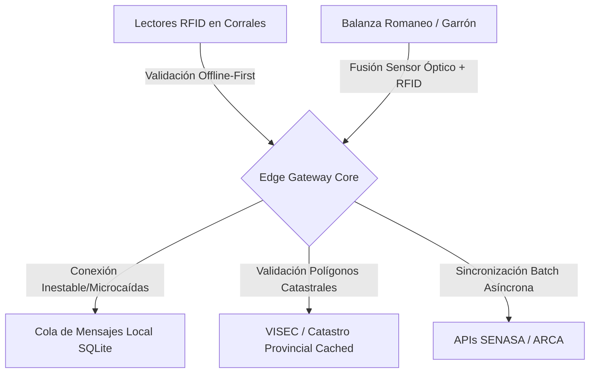

# Pre-Mortem: Hub de Trazabilidad Ganadera Full-Stack (Campo-Gancho-Puerto)
> **Asociado a:** [[Full_Stack_Traceability_Hub]]  
> **Fecha de Autopsia:** 2026-05-25  
> **Clasificación:** Herramienta de Análisis Forense Prospectivo para AgTech (SFaaS)  

---

## FASE 0: RADIOGRAFÍA PREVIA

* **Tesis central del plan:**  
  Crear un Hub SaaS/IoT backend (Java/Quarkus) que integre la lectura masiva de caravanas RFID de ganado en pie con el romaneo digital (garrón) en frigoríficos exportadores, mitigando el vacío regulatorio estatal mediante un validador nativo de deforestación (VISEC/EUDR) e inmutabilidad de datos en ledger privado.

* **Vectores de Fricción SFaaS activados:**
  1. **Integración Técnica (Integration-as-a-Service):** Dependencia de APIs y sistemas estatales (SENASA SIGSA/DT-e y ARCA/AFIP) para verificar el stock histórico y autorizar el tránsito de animales vinculados.
  2. **Arbitraje y Confianza (Arbitration-as-a-Service):** Sustitución de la fe pública estatal por una certificación privada basada en ledger inmutable y validación de polígonos EUDR.
  3. **Desprotección Geopolítica (EUDR & Exportación):** Protección técnica del frigorífico exportador ante la desidia de los sistemas del Estado nacional para certificar campos libres de deforestación de manera automatizada.

* **Vectores de Fricción SFaaS ignorados (Puntos ciegos):**
  1. **Desacople Físico-Digital:** Choque severo entre la latencia requerida por la faena industrial en tiempo real y el colapso operativo-material en el pesaje del garrón (altísima interferencia de las jaulas de Faraday metálicas de la planta de faena y falta de conectividad offline-first en zonas rurales).
  2. **Asimetría Algorítmica:** Ausencia de resiliencia operativa ante bloqueos "caja negra" ex-post del regulador (ej. suspensiones preventivas de CUIT de productores en ARCA que invalidan de golpe toda la mercadería ya faenada en pleno stock).

* **Supuestos ocultos:**
  1. *Supuesto 1:* Que el productor ganadero intermedio colocará y cuidará la caravana RFID obligatoria sin "reciclar" tags electrónicos de animales muertos o descartados para hacer pasar animales no trazados (*spoofing analógico*).
  2. *Supuesto 2:* Que el ERP heredado de los frigoríficos (predominantemente SAP R/3 viejos o AS400 legados sin APIs modernas) tolerará una sincronización de eventos de ultra-baja latencia en Quarkus sin requerir meses de consultoría y desarrollo a medida.
  3. *Supuesto 3:* Que la prórroga de la EUDR es un catalizador comercial infalible, asumiendo que los frigoríficos comprarán software sofisticado en vez de exigir a sus propios despachantes y certificadoras manuales que absorban el riesgo administrativo.

* **Modelo B2B o B2C Check:**  
  El modelo es estrictamente **B2B** (Frigoríficos Exportadores, Feedlots y Certificadoras) operando sobre base monetaria en USD. Sin embargo, su talón de Aquiles operativo está acoplado al eslabón inicial de la cadena de suministro: el criador extensivo de terneros, un actor pesadamente descapitalizado en pesos que carece de incentivos inmediatos para tecnificar sus mangas.

---

## FASE 1: EL ESCENARIO CATASTRÓFICO
**Fecha de simulación:** 25 de noviembre de 2027 (18 meses en el futuro).

El Hub de Trazabilidad Ganadera Full-Stack ha colapsado de forma irreversible. Las pérdidas de capital superan los USD 650,000, los tres clientes piloto rescindieron sus contratos exigiendo compensaciones por cargamentos rechazados y daños reputacionales, y el churn comercial es del 100%. El motor de eventos en Quarkus, aunque impecable en pruebas de laboratorio de software, terminó convirtiéndose en un procesador de datos corruptos debido a la desconexión total entre la realidad del barro en los corrales, la física electromagnética del frigorífico y la volatilidad del marco regulatorio argentino.

---

## FASE 2: PANEL DE FORENSES

1. **El Regulador Fantasma (Dra. Silvina Mantovani - Ex-directora de Asuntos Jurídicos de SENASA):**  
   *Idoneidad:* Conoce la inestabilidad de las resoluciones ganaderas (como la flexibilización de la Res. 841-2025) y cómo el Estado improvisa parches burocráticos ante las presiones de las cámaras de consumo interno (CICCRA), destruyendo la obligatoriedad real de la trazabilidad individual electrónica de la noche a la mañana.
2. **El Operador de Trinchera (Ing. Agr. Walter "Vasco" Garmendia - Gerente de Operaciones del Frigorífico "La Pampeana"):**  
   *Idoneidad:* Conoce el "barro de la manga". Sabe que en la faena diaria los operarios trabajan a destajo, la humedad corroe las antenas RFID, y la velocidad de la noria no admite demoras por reintentos de red o caídas de conectividad.
3. **El Escéptico Financiero (Juan Cruz Altamira - Managing Partner de Pampa Sur Ventures):**  
   *Idoneidad:* Experto en unit economics de AgTech Latam. Detecta de inmediato cómo los costos ocultos de integración del software (onboarding, customización de ERPs legados) licúan cualquier margen del SaaS recurrente estándar.
4. **El Ingeniero de Sistemas (Ing. Esteban "Gringo" Rostagno - Lead Architect ex-Globant / IoT Industrial):**  
   *Idoneidad:* Experto en el procesamiento de eventos asíncronos y redes de sensores en entornos metálicos masivos de alta interferencia electromagnética.
5. **El Geopolítico Frío (Dr. Dieter Kretzschmar - Director de Compliance de EuroCarnes S.A.):**  
   *Idoneidad:* Experto en las aduanas de destino, las reglamentaciones del EUDR y la burocracia de importación de la UE. Sabe qué tipo de validación legal exigen los importadores en Róterdam y Amberes.

---

## FASE 3: HISTORIAS DEL DESASTRE FORENSE

### 1. El Regulador Fantasma
> *"La ley se acata pero no se cumple, y si aprieta demasiado, se deroga."*

* **El Detalle Fatal Ignorado:**  
  El equipo asumió que la obligatoriedad del ID electrónico individual (RFID) en Argentina era un camino sin retorno regulatorio decretado de manera inquebrantable a partir de julio 2026. Ignoraron que la presión de los criadores pequeños de las provincias del NEA y NOA (sin escala y sin conectividad) obligaría a la Secretaría de Agricultura a emitir resoluciones de excepción.
* **La Cadena Causal:**  
  * **Mes 1 a 3:** Se lanza el Hub. Los frigoríficos exigen caravanas RFID a sus proveedores de hacienda para alimentar la base de datos transaccional.  
  * **Mes 4 a 6:** Ante la escasez de terneros con caravanas RFID válidas por desabastecimiento físico de los proveedores autorizados y el costo unitario de las mismas, SENASA emite una "Resolución de Emergencia" que permite ingresar hacienda con caravanas tradicionales de botón (analógicas) ingresando el número manualmente en el DT-e.  
  * **Mes 7 a 12:** El Hub pierde su insumo digital automatizado básico. Los operadores en planta deben tipear manualmente números de 12 dígitos en una interfaz móvil mojada y con guantes de cuero. La tasa de error en la carga manual explota al 22%, provocando inconsistencias masivas entre el DT-e y el garrón final.  
  * **Mes 18:** El sistema colapsa bajo el peso de su propia inconsistencia de datos y el desuso de las lecturas automáticas.
* **El Veredicto del Vector:**  
  **Integración Técnica (API del Estado de Datos).** El Hub no previó un mecanismo degradado elegante (graceful degradation) para la convivencia con sistemas analógicos transicionales habilitados por el regulador.

### 2. El Operador de Trinchera
> *"En el frigorífico, si la noria se frena por culpa de un sistema informático durante 10 minutos, te tiran las computadoras al digestor."*

* **El Detalle Fatal Ignorado:**  
  La confianza ingenua en que el entorno físico de la línea de faena permitiría una lectura RFID limpia e instantánea del animal vivo y su inmediata correlación electrónica con el romaneo (peso del garrón).
* **La Cadena Causal:**  
  * **Mes 1 a 2:** Instalación de las antenas RFID en los corrales de aturdimiento y en la entrada de la noria de faena metálica.
  * **Mes 3 a 5:** Las masivas estructuras de acero inoxidable del frigorífico actúan como una jaula de Faraday, rebotando e interfiriendo las ondas de radiofrecuencia (UHF/HF). Dos caravanas leídas casi al mismo tiempo en el embudo producen colisión de tags, registrando al animal equivocado en el garrón que pasaba por la balanza digital 20 segundos después.
  * **Mes 6 a 9:** [ESPECULACIÓN] El personal de planta, presionado por los delegados gremiales para no ralentizar el ritmo de faena (que determina el salario por productividad), empieza a pasar animales por el lector sin corroborar la luz verde de validación del software.
  * **Mes 18:** Se descubre que 4,500 medias reses de exportación fueron marcadas con las coordenadas geográficas y polígonos EUDR de un campo que no les correspondía debido a la desincronización acumulada de la cola de eventos en la balanza de romaneo. Los frigoríficos cancelan el contrato tras multas aduaneras billonarias.
* **El Veredicto del Vector:**  
  **Desacople Físico-Digital.** La incapacidad de la arquitectura transaccional digital para absorber y corregir físicamente las colisiones electromagnéticas de hardware en la línea operativa real.

### 3. El Escéptico Financiero
> *"Venderle SaaS puro a un frigorífico argentino es como venderle suscripciones de software a un pirata del asfalto: solo pagarán si la soga regulatoria los está asfixiando hoy, y buscarán la primera excusa para cortar el servicio."*

* **El Detalle Fatal Ignorado:**  
  El supuesto de que el Hub era un producto SaaS estandarizado, escalable y con despliegues de bajo costo humano, subestimando la altísima fragmentación del ecosistema ERP de la industria cárnica argentina.
* **La Cadena Causal:**  
  * **Mes 1 a 4:** El primer cliente firma contrato B2B en USD. Pero exige que el Hub vuelque los datos de trazabilidad directamente en su ERP propietario (desarrollado en COBOL/Clipper a finales de los noventa por programadores locales que ya se jubilaron).
  * **Mes 5 a 8:** El equipo de desarrollo del Hub suspende el desarrollo de la plataforma core en Java/Quarkus para transformarse en una "consultora de integraciones a medida" tratando de escribir sockets UDP y conectores SOAP inestables para cada frigorífico. Los Unit Economics del negocio pasan de un margen bruto proyectado del 80% a un margen negativo del -35% por el exceso de horas de ingeniería consumidas "in-situ".
  * **Mes 9 a 14:** El flujo de caja se agota. La ronda puente de capital semilla fracasa porque el crecimiento de clientes recurrentes (MRR) se estanca debido a los tiempos eternos de onboarding técnico (más de 120 días por frigorífico).
  * **Mes 18:** Muerte por insolvencia y asfixia financiera operativa.
* **El Veredicto del Vector:**  
  **Integración Técnica (Private Integration-as-a-Service).** Ignorar que la fricción técnica no residía en las APIs modernas del Estado, sino en el abismo tecnológico del core heredado de los propios clientes corporativos.

### 4. El Ingeniero de Sistemas
> *"La arquitectura asincrónica en Quarkus resiste millones de transacciones por segundo en Kubernetes, pero muere cuando una API de SENASA del año 2012 responde con un Timeout HTTP de 90 segundos."*

* **El Detalle Fatal Ignorado:**  
  Suponer que las APIs de SENASA (SIGSA) y ARCA (CPE) operarían con niveles de SLA de grado industrial compatibles con un backend transaccional de alta frecuencia.
* **La Cadena Causal:**  
  * **Mes 1 a 3:** El Hub procesa con éxito las lecturas y despacha llamadas asincrónicas en lotes hacia las APIs públicas para validar los números de DTE y CUIT de los productores en tránsito.
  * **Mes 4 a 8:** [ESPECULACIÓN] Durante los picos estacionales de movimiento de hacienda (otoño/primavera), los servidores estatales entran en colapso sistémico. Las APIs de SENASA demoran hasta 2 minutos en responder o devuelven errores HTTP 502 Bad Gateway recurrentes.
  * **Mes 9 a 12:** El motor en Quarkus encola miles de mensajes pendientes en Kafka. Como las reses no pueden detener su proceso de enfriamiento a la espera de la validación informática, el sistema decide "permitir el paso" (bypass en caliente) almacenando los eventos localmente. Cuando los servidores estatales reviven, la reconciliación ex-post falla estrepitosamente debido a cambios no informados en los esquemas de validación del regulador fiscal.
  * **Mes 18:** Corrupción generalizada de bases de datos. El Hub se vuelve incapaz de reconstruir de forma auditable los "logs de trazabilidad" requeridos por los clientes europeos.
* **El Veredicto del Vector:**  
  **Asimetría Algorítmica.** Incapacidad del sistema para auto-gestionarse ante las respuestas opacas y arbitrarias (latencia extrema, cambios de API sin control de versiones) del "Estado de Datos".

### 5. El Geopolítico Frío
> *"La Unión Europea y China no validan tecnología privada por más 'blockchain' o 'ledger inmutable' que sea; solo validan firmas estatales soberanas o consorcios de exportación avalados."*

* **El Detalle Fatal Ignorado:**  
  Creer que la incorporación de un "ledger inmutable de auditoría privada" resolvería la desprotección geopolítica de los frigoríficos, asumiendo que los importadores en Europa aceptarían el certificado digital del Hub de manera independiente al desmantelamiento institucional del SENASA.
* **La Cadena Causal:**  
  * **Mes 1 a 6:** Los frigoríficos promocionan con orgullo el uso del "Ledger Antispoofing" ante brokers de la UE.
  * **Mes 7 a 12:** Las auditorías de la DG SANTE de la Comisión Europea dictaminan que las auto-certificaciones de herramientas privadas carecen de validez legal si la autoridad de aplicación local (SENASA) no valida fehacientemente mediante inspección ocular estatal los polígonos de deforestación del campo de origen.
  * **Mes 13 a 18:** La Bolsa de Comercio de Rosario (BCR) expande la cobertura de VISEC a nivel nacional sin costo de integración transaccional directa, ofreciendo un bypass gratuito de compliance soberano que los importadores sí convalidan por presión política de las cerealeras. El Hub se vuelve comercialmente obsoleto en una sola tarde.
* **El Veredicto del Vector:**  
  **Desprotección Geopolítica (EUDR & Exportación).** El Hub intentó crear un árbitro digital privado ("ledger") en un mercado geopolítico que exige exclusivamente validación institucional soberana o consorcios corporativos unificados.

---

## FASE 4: ANTÍDOTO TÁCTICO Y MAPA DE RIESGOS

### A. Los 3 Vectores de Riesgo Macro

1. **Riesgo de Integración Legacy Frigorífica**  
   * *Probabilidad:* **Alta** | *Justificación:* Prácticamente la totalidad de los frigoríficos exportadores medianos y grandes en Argentina operan con sistemas ERP arcaicos y bases de datos cerradas con nula capacidad de streaming de datos asíncronos en tiempo real.  
   * *Horizonte temporal:* Mes 3 a 5 del despliegue.  
   * *Vector SFaaS Comprometido:* **Integración Técnica.**

2. **Riesgo de Desacople Físico en Línea de Faena (Interferencia RFID y velocidad industrial)**  
   * *Probabilidad:* **Alta** | *Justificación:* Los entornos industriales con agua constante, grasa, y masivas estructuras aéreas de hierro y acero inoxidable son los escenarios de peor desempeño para la radiofrecuencia UHF estándar.  
   * *Horizonte temporal:* Mes 1 a 3 (pruebas en planta).  
   * *Vector SFaaS Comprometido:* **Desacople Físico-Digital.**

3. **Riesgo de Regresión o Flexibilización Regulatoria**  
   * *Probabilidad:* **Media-Alta** | *Justificación:* El lobby de la producción ganadera tradicional contra los costos de identificación electrónica individual suele forzar prórrogas estatales indefinidas o esquemas de excepción laxos.  
   * *Horizonte temporal:* Mes 6 a 12.  
   * *Vector SFaaS Comprometido:* **Asimetría Algorítmica / Arbitraje.**

---

### B. Los 5 Ajustes Arquitectónicos Obligatorios

1. **Arquitectura Edge Offline-First con Buffering de Mensajes:**  
   * *Descripción:* Eliminar llamadas REST síncronas hacia APIs externas o ERPs centrales en la línea de pesaje de garrón. Implementar un Edge Gateway local en cada planta que opere con una base de datos embebida (SQLite/RocksDB) y una cola de mensajería tolerante a fallas (local broker asíncrono). El emparejamiento RFID-Garrón se resuelve localmente en menos de 50ms y se sincroniza en batch en segundo plano cuando las APIs de SENASA/ARCA estén disponibles.  
   * *Costo:* 3 semanas de ingeniería backend Quarkus (implementación de patrones Circuit Breaker y Outbox).  
   * *Riesgo Mitigado:* Caídas y latencias de APIs estatales.

2. **Fusión de Sensores (RFID + Visión Artificial de Respaldo):**  
   * *Descripción:* Para resolver la colisión electromagnética de tags en la noria de faena, se debe incorporar una cámara industrial en la balanza de garrón que lea un código QR/DataMatrix grabado con láser en la etiqueta física del gancho metálico del garrón al mismo tiempo que la antena RFID lee la caravana del animal. El emparejamiento no depende de una ventana temporal teórica sino de la coexistencia física del sensor óptico y electromagnético.  
   * *Costo:* USD 8,000 en hardware de cámara industrial por línea + 4 semanas de desarrollo del módulo de visión artificial en Python/C++ conectado al backend Java.  
   * *Riesgo Mitigado:* Desacople Físico-Digital (lecturas falsas positivas o desfasadas).

3. **SDK de Integración Standard (Zero-Touch ERP Adapter):**  
   * *Descripción:* Prohibir el desarrollo de integraciones personalizadas directas a los ERPs de los frigoríficos. El Hub debe exponer una API REST/gRPC propia ultra-documentada y un Agente de Integración liviano (escrito en Java/GraalVM) que el equipo de IT del frigorífico debe implementar y configurar bajo su exclusiva responsabilidad como precondición para el Go-Live.  
   * *Costo:* 4 semanas de desarrollo de arquitectura y documentación técnica estandarizada.  
   * *Riesgo Mitigado:* Deriva del modelo de negocio de SaaS escalable hacia consultoría deficitaria.

4. **Integración Nativa y Reconciliación con el Repositorio Soberano VISEC:**  
   * *Descripción:* Modificar el validador EUDR propietario del Hub para que no intente autodeclararse árbitro de confianza directo ante la UE. En su lugar, debe actuar como un "agregador automatizado" de certificados emitidos oficialmente por VISEC (Bolsa de Comercio de Rosario), realizando cruces algorítmicos instantáneos entre el ID del animal, el número de establecimiento de origen (RENSPA) y la base de datos oficial del consorcio VISEC para generar reportes en el formato estandarizado que las cerealeras y frigoríficos exportadores ya tienen aprobado en Europa.  
   * *Costo:* 2 semanas de desarrollo e integración de APIs con VISEC.  
   * *Riesgo Mitigado:* Desprotección Geopolítica y obsolescencia frente a soluciones consorciadas estatales/privadas existentes.

5. **Módulo de "Filtro de Fraude Analógico" (Spoofing Alert):**  
   * *Descripción:* Implementar lógica heurística en el motor transaccional para detectar anomalías físicas en las caravanas RFID. Por ejemplo, alertar inmediatamente si la misma caravana RFID registra lecturas en un feedlot a 400 km de distancia y en la planta de faena con una diferencia de tiempo físicamente imposible, o si un lote completo de terneros muestra lecturas de chips electrónicos secuenciales perfectos fabricados en fechas disímiles, sugiriendo un re-caravaneado fraudulento antes de la carga en camión.  
   * *Costo:* 1 semana de lógica matemática y alertas asíncronas en Quarkus.  
   * *Riesgo Mitigado:* Fraude analógico de proveedores de hacienda que destruye la validez del romaneo exportable.

---

### C. Veredicto Final

⚠️ **REQUIERE REDISEÑO FUNDAMENTAL**

**Justificación:**  
La tesis central de valor del proyecto ("Hub de Trazabilidad Ganadera") es un painkiller legal indiscutible, pero su arquitectura original adolece de un optimismo digital ciego ante el barro físico del frigorífico y la inestabilidad de las integraciones de los ERPs legados de los clientes. Lanzar el software tal como está diseñado hoy, con dependencias directas en APIs síncronas estatales y confiando exclusivamente en lecturas de radiofrecuencia sin soporte óptico en líneas de faena metálicas, llevará a la muerte del proyecto por churn técnico y costos de integración a medida insostenibles en un plazo menor a los 12 meses. 

**Acción Requerida:**  
Frenar la inyección de capital en marketing o ventas y reasignar los recursos de desarrollo de los próximos dos sprints para soldar los **Ajustes Arquitectónicos 1 (Edge Offline-First)**, **2 (Fusión de Sensores con Visión)** y **3 (Standard Integration API)**. No se debe avanzar en la fase de captación comercial de frigoríficos piloto hasta que el motor asíncrono Quarkus demuestre tolerancia a fallas físicas y desconexión completa en un entorno industrial real simulado.

---
*Fin de la Autopsia Forense Prospectiva.*
