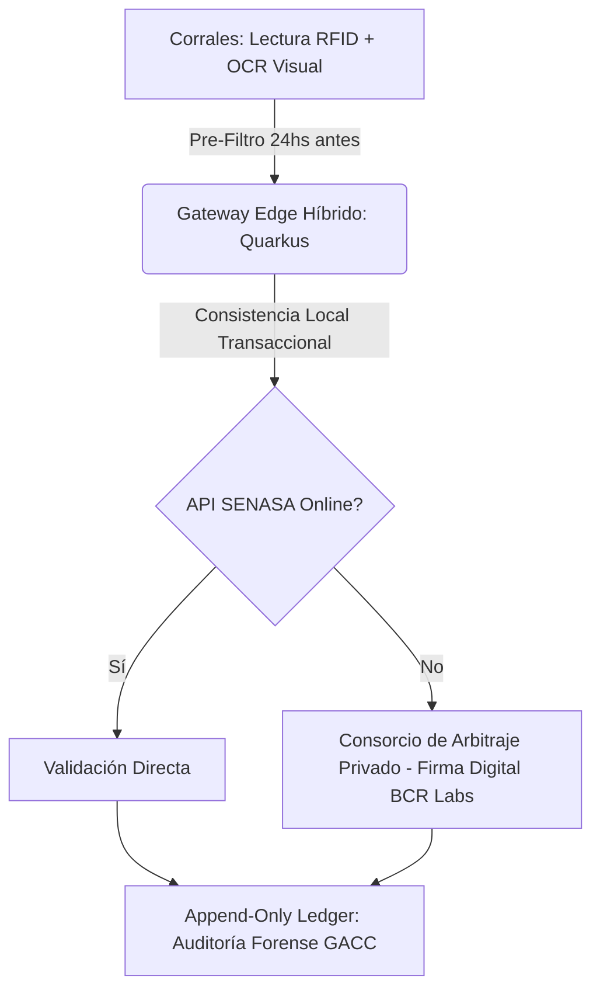

# Pre-Mortem Forense: Gorina Sanitary Shield SaaS

## FASE 0: Radiografía previa

* **Tesis central**: Un middleware crítico (Java/Spring Boot) conectado a lectores RFID industriales en la noria de faena de Frigorífico Gorina para realizar un cruce en tiempo real del estatus sanitario del ganado contra los protocolos de aftosa de China, mitigando el riesgo de bloqueo comercial ante la inestabilidad de las consultas directas en SENASA (SIGSA).
* **Vectores de Fricción activados**:
  * **Integración Técnica (Integration-as-a-Service):** Dependencia crítica del cruce instantáneo de datos (con contingencia offline) con el sistema SIGSA de SENASA y los registros de DT-e/caravanas.
  * **Arbitraje y Confianza (Arbitration-as-a-Service):** Validación sanitaria privada "trustless" como escudo ante la caída operativa del Estado como certificador neutral infalible.
  * **Desprotección Geopolítica (Exportación China):** Exposición total a las regulaciones sanitarias de exportación (GACC de China) operando bajo la amenaza de bloqueos catastróficos inmediatos.
  * **Desacople Físico-Digital:** Intento de emparejar lecturas físicas RFID ultrarrápidas en un entorno industrial hostil con transacciones lógicas y bases de datos.
* **Vectores ignorados:**
  * **Asimetría Algorítmica:** Ausencia de modelado sobre cómo las reglas de bloqueo preventivo de SENASA y cambios de semáforos sanitarios se aplican ex-post y sin preaviso en el sistema.
  * **Mutualización (Private Pooling):** La solución se plantea exclusivamente para Gorina, ignorando la posibilidad de consorciar el costo y la confianza técnica con otros exportadores de la cámara frigorífica para dar validez sistémica al "Shield".
* **Supuestos ocultos:**
  1. *Perfecta legibilidad y fidelidad del tag RFID*: Se asume que el 100% de los animales llegan con caravanas RFID válidas, legibles, y no adulteradas ni dañadas físicamente en el transporte o corrales.
  2. *Infalibilidad del Caché Offline*: Se presupone que un snapshot local desactualizado del estatus sanitario (SIGSA) es legal y sanitariamente válido ante una auditoría china si el sistema central del Estado está caído.
  3. *Viabilidad de la detención de la noria de faena*: Se asume que la planta aceptará de inmediato que una alarma del software detenga físicamente una línea de producción de alta velocidad que procesa cientos de cabezas por hora.
* **Modelo B2B/B2C check**: **CUMPLE.** El cliente objetivo es un frigorífico exportador líder (Gorina) con transacciones dolarizadas, alta capacidad de pago y nula sensibilidad a tarifas de software si estas mitigan un riesgo multimillonario.

---

## FASE 1: El escenario catastrófico (18 meses en el futuro)

**Fecha:** 25 de noviembre de 2027.  
El proyecto **Gorina Sanitary Shield** ha fracasado de manera rotunda, catastrófica e irreversible. La planta de faena de Frigorífico Gorina en La Plata se encuentra bloqueada indefinidamente por la Administración General de Aduanas de la República Popular China (GACC). La compañía enfrenta pérdidas directas que superan los **4.5 millones de dólares** debido a la retención de 180 contenedores de carne en tránsito en los puertos de Shanghái y Shenzhen. 

El equipo de IT de Gorina ha desconectado físicamente los gateways Edge del sistema, el churn es del **100%**, y nuestra reputación en el ecosistema AgTech argentino está destruida. Esta autopsia forense busca reconstruir de forma implacable la cadena causal que llevó al colapso del sistema.

---

## FASE 2: Panel de forenses

Para desmantelar los sesgos de optimismo comercial que condenaron el proyecto, el comité de autopsia opera en aislamiento absoluto bajo 5 perspectivas hiper-especializadas en la realidad ganadera e industrial argentina:

1. **El Regulador Fantasma** (Dra. Silvina Mantegazza, ex-Asesora Legal del SENASA): Experta en los laberintos regulatorios de la Ley 27.233 de responsabilidad sanitaria. Evaluará si las validaciones offline del "Shield" carecían de validez de derecho público ante cambios de normativas estatales.
2. **El Operador de Trinchera** (Ing. Roberto "Tito" Benítez, ex-Gerente de Planta de Gorina): Evaluará el comportamiento del hardware RFID y el middleware en el entorno físico real de la noria de faena (vapor, grasa, sangre y ruido electromagnético de motores industriales).
3. **El Escéptico Financiero** (Lucas Agote, VC en Pampa Tech Ventures): Analizará los unit economics reales del despliegue físico-digital y la viabilidad de cobrar una suscripción en USD frente al estrangulamiento de los márgenes de exportación y costos ocultos de soporte in-situ.
4. **El Ingeniero de Sistemas** (Lic. Damián Galarza, Arquitecto Java Backend y Middleware): Analizará la estabilidad de las APIs de SENASA, el diseño de la base de datos distribuida y los fallos de consistencia del caché local offline.
5. **El Geopolítico Frío** (Emb. Esteban Almonacid, Consultor de Comercio Exterior con China): Evaluará la rigidez e inflexibilidad diplomática de las auditorías chinas y por qué un sistema privado nunca pudo actuar como escudo sanitario sin el respaldo soberano formal del Estado argentino.

---

## FASE 3: Historias del desastre forense

### 1. El Regulador Fantasma (Dra. Silvina Mantegazza)
* **El Detalle Fatal Ignorado:** La falsa equivalencia entre validación técnica privada y validez legal administrativa. El equipo asumió que si el "Shield" validaba offline una firma digital, esto eximía a Gorina de responsabilidad si la base central de SENASA difería.
* **La Cadena Causal:** En el mes 4, SENASA promulgó una resolución de emergencia interna (post-Res. 841-2025) que inhabilitó la delegación de firmas sanitarias y la validación asincrónica para exportaciones a China. Todo animal faenado debía tener validación "online y en vivo" en el SIGSA al momento exacto de la faena. En el mes 9, debido a caídas recurrentes del servidor central de SENASA en Buenos Aires, el "Shield" de Gorina autorizó la faena de 1.200 cabezas bajo modalidad "offline validado". En el mes 12, una auditoría digital cruzada detectó que 14 de esos animales pertenecían a un establecimiento de Corrientes bajo cuarentena preventiva emitida horas antes (pero no sincronizada por caída de API). El "Shield" actuó legalmente de forma nula; el Estado consideró la faena como infracción grave al protocolo bilateral de aftosa.
* **El Veredicto del Vector:** **Arbitraje y Confianza (Falla Crítica).** La pérdida del Estado como validador neutral no puede ser sustituida por un middleware privado si el regulador final (China) solo reconoce la fe pública estatal.

### 2. El Operador de Trinchera (Ing. Roberto "Tito" Benítez)
* **El Detalle Fatal Ignorado:** Las interferencias electromagnéticas masivas y la hostilidad física del riel de faena rápida. Se probó el sistema con un lector RFID portátil en corrales silenciosos, pero no bajo la lluvia de agua a 85°C, sangre, grasa y las vibraciones mecánicas de los motores de 50 HP de la noria de faena.
* **La Cadena Causal:** Tras la instalación en el mes 3, las antenas fijas RFID en el riel comenzaron a experimentar una tasa de lectura fallida (miss rate) del **12%** debido al ruido metálico de los ganchos de faena y el blindaje natural de los cuerpos húmedos de los animales. El sistema disparaba falsas alarmas de "Animal No Trazado / Detener Faena". En el mes 6, cansados de las interrupciones en la producción (que costaban USD 8.000 por cada 15 minutos de parada), los operarios de planta instalaron un bypass manual (un switch físico) que simulaba lecturas aprobadas en el ERP legacy de Gorina. El software siguió reportando "100% de consistencia" en los dashboards gerenciales, mientras la realidad física en la trinchera era de un bypass sistemático del control.
* **El Veredicto del Vector:** **Desacople Físico-Digital (Falla Crítica).** El software operaba en un universo lógico perfecto mientras la captura de datos en el mundo físico de la planta estaba totalmente rota.

### 3. El Escéptico Financiero (Lucas Agote)
* **El Detalle Fatal Ignorado:** El sangrado de caja por soporte técnico de hardware customizado in-situ, comercializado bajo una falsa ilusión de "SaaS puro de alto margen".
* **La Cadena Causal:** En el mes 2, nos dimos cuenta de que no podíamos delegar la calibración de las antenas RFID industriales ni el mantenimiento de los gateways Edge en el equipo de IT interno de Gorina, que ya estaba saturado con su ERP legacy. Tuvimos que subcontratar ingenieros de campo para dar soporte 24/7 en la planta de La Plata. El costo de este soporte técnico presencial y la sustitución de hardware dañado por humedad devoró el 90% de la tarifa de suscripción mensual. Al no poder escalar este modelo a otros frigoríficos sin duplicar los ingenieros de campo, la empresa se quedó sin caja en el mes 10. Las proyecciones de margen bruto del 85% colapsaron a un **-15%** neto real.
* **El Veredicto del Vector:** **Modelo B2B Imperfecto (Falla Operativa).** El modelo financiero de software puro no resiste la fricción física de la integración de hardware de campo no estandarizado en la industria frigorífica.

### 4. El Ingeniero de Sistemas (Lic. Damián Galarza)
* **El Detalle Fatal Ignorado:** La suposición de consistencia eventual en un entorno de APIs gubernamentales que carecen de idoneidad transaccional y sufren alta latencia.
* **La Cadena Causal:** El stack construido sobre Spring Boot pesado requería un consumo excesivo de memoria en los nodos Edge instalados en planta. Durante el mes 8, ante caídas de la API del SIGSA de SENASA que duraban más de 12 horas, el "Shield" acumuló miles de transacciones de faena en una base de datos local embebida H2. Cuando la conexión retornó, el proceso de sincronización asincrónica bloqueó las conexiones por concurrencia debido al volumen de peticiones y a errores de formato de la API gubernamental. La base de datos local se corrompió debido a escrituras simultáneas y fallos de red intermitentes, dejando registros huérfanos que permitieron el ingreso de lotes sin vacunar al circuito de exportación.
* **El Veredicto del Vector:** **Integración Técnica (Falla Crítica).** El intento de orquestar transacciones críticas de exportación en tiempo real basándose en un "Estado de Datos" estatal inestable sin una arquitectura de mensajería asincrónica robusta y tolerante a fallos catastróficos.

### 5. El Geopolítico Frío (Emb. Esteban Almonacid)
* **El Detalle Fatal Ignorado:** La absoluta inflexibilidad soberana de la aduana china (GACC) y la imposibilidad de que un exportador justifique inconsistencias a través de "auditorías de software privado".
* **La Cadena Causal:** En el mes 14, un lote validado "offline" por nuestro sistema llegó a Shanghái. Durante la inspección física, los funcionarios de la GACC escanearon los códigos y cruzaron los datos directamente con la base de datos nacional de la Cancillería y del SENASA central (no con nuestro caché firmado digitalmente). Al existir una discrepancia de horas en la fecha de liberación del DT-e, la GACC catalogó el embarque como "Contrabando Técnico / Riesgo de Aftosa". No importaron los logs del middleware ni la inmutabilidad de nuestras firmas criptográficas: para el gobierno de Pekín, si no coincide en el servidor oficial del gobierno argentino, el producto es ilegal. El bloqueo total a Gorina se ejecutó en 24 horas, destruyendo el flujo de caja del frigorífico y forzando la rescisión del contrato de software.
* **El Veredicto del Vector:** **Desprotección Geopolítica (Falla Fatal).** Creer que el mercado de exportación de commodities puede autoregularse o utilizar validaciones privadas para saltarse las deficiencias del canal soberano institucional.

---

## FASE 4: Antídoto táctico y mapa de riesgos

### A. Los 3 Vectores de Riesgo Macro

1. **Inconsistencia de Datos del Canal Soberano (SENASA SIGSA):**
   * **Probabilidad:** Alta.
   * **Justificación:** Caídas frecuentes de servidores estatales y cambios discrecionales en las reglas de negocio de la API del SIGSA.
   * **Horizonte:** 3 meses.
   * **Vector Comprometido:** Integración Técnica / Asimetría Algorítmica.

2. **Falla en Captura de Datos por Interferencia Electromagnética / Bypass Humano:**
   * **Probabilidad:** Alta.
   * **Justificación:** El entorno ruidoso de la planta invalida lecturas RFID y provoca que los operarios saboteen el flujo para no detener la producción física.
   * **Horizonte:** 1 mes (durante la primera semana de pruebas de hardware en la noria).
   * **Vector Comprometido:** Desacople Físico-Digital.

3. **Rechazo Soberano de Auditorías Digitales Privadas por parte de la GACC (China):**
   * **Probabilidad:** Media.
   * **Justificación:** Pekín no acepta justificaciones de sistemas privados si los datos oficiales argentinos difieren de los presentados en aduana.
   * **Horizonte:** 6-12 meses (al arribo de los primeros embarques a puerto de destino).
   * **Vector Comprometido:** Desprotección Geopolítica.

---

### B. 5 Ajustes Arquitectónicos Obligatorios

1. **Pre-Filtrado y Lectura Redundante en Corrales de Recepción (24 Horas de Gracia):**
   * **Descripción:** Eliminar la validación en tiempo real directamente sobre el riel de la noria de faena rápida. La lectura de tags RFID se debe realizar 24 horas antes, al descargar el ganado en los corrales de recepción, combinando antenas de alta potencia con cámaras OCR para lectura visual de las caravanas. Esto otorga una ventana de tiempo de 24 horas para sincronizar y rectificar datos con el SIGSA offline.
   * **Costo/Recursos:** Alto (instalación de pórticos de lectura en corrales + software de visión computacional OCR).
   * **Mitigación:** Desacople Físico-Digital y caídas cortas de API de SENASA.

2. **Migración a Stack Edge Híbrido (Docker / Quarkus Backend / MQTT):**
   * **Descripción:** Reemplazar el backend pesado en Spring Boot por Quarkus nativo compilado con GraalVM, reduciendo drásticamente la latencia y huella de memoria en los gateways industriales en planta. El middleware debe utilizar colas de mensajería ligera (protocolo MQTT mediante RabbitMQ) persistidas en discos SSD industriales para garantizar que no se pierda un solo frame de lectura de hardware, eliminando dependencias de escritura en bases locales SQL embebidas.
   * **Costo/Recursos:** Alto (2 meses de refactorización backend y re-arquitectura).
   * **Mitigación:** Integración Técnica y caídas del sistema local de planta.

3. **Consorcio de Arbitraje con Tercero Habilitado (Private Pooling):**
   * **Descripción:** Establecer un acuerdo de validación privada cruzada con laboratorios e instituciones comerciales neutrales de prestigio (como la Bolsa de Comercio de Rosario - BCR Labs o certificadores internacionales habilitados por China). Si el sistema SENASA se cae, la validación offline se respalda mediante una auditoría técnica inmediata firmada digitalmente por el consorcio privado neutral, brindando un marco legal de arbitraje sólido que SENASA y la GACC contemplen en sus protocolos de contingencia.
   * **Costo/Recursos:** Medio (negociación comercial y desarrollo de API de integración).
   * **Mitigación:** Arbitraje y Confianza.

4. **Bypass Criptográfico Inviolable (State-Lock de Faena):**
   * **Descripción:** Eliminar la posibilidad de que los operarios o supervisores de planta hagan bypass físico al sistema con un interruptor. Si el sistema detecta inconsistencia o falta de lectura, la noria de faena se bloquea por software y solo puede ser destrabada mediante la inserción de una clave criptográfica (firma digital del Director de Control de Calidad de Gorina), registrando el evento de manera inmutable.
   * **Costo/Recursos:** Bajo (1 semana de desarrollo de software y políticas de control).
   * **Mitigación:** Desacople Físico-Digital y sabotaje operativo por velocidad de producción.

5. **Módulo Append-Only Ledger para Auditorías de Cumplimiento GACC:**
   * **Descripción:** Implementar una base de datos inmutable append-only (ej. utilizando PostgreSQL con tablas de histórico bloqueadas criptográficamente o QLDB local) que registre de forma inmutable cada consulta de caravana, respuesta de SENASA y firma de validación. Esto provee un rastro forense inalterable listo para exportación inmediata como PDF/JSON auditables para presentar ante inspectores de la GACC o SENASA durante inspecciones en planta.
   * **Costo/Recursos:** Medio (2 semanas de desarrollo).
   * **Mitigación:** Desprotección Geopolítica.

---

### C. Veredicto Final

⚠️ **REQUIERE REDISEÑO FUNDAMENTAL**

**Justificación:** La tesis original es inviable en su concepción actual por dos fallas estructurales:
1. Pretender controlar el flujo sanitario en la **noria de faena rápida** (fase crítica donde detener la faena tiene un costo destructivo) en lugar de hacerlo de manera preventiva en los **corrales de recepción** con una ventana de 24 horas.
2. Suponer que el frigorífico puede prescindir del aval institucional formal del Estado para exportar a un mercado ultrarrígido como el chino. 

El proyecto **solo debe ejecutarse si se implementan los cambios arquitectónicos detallados**, reubicando los puntos de captura física al ingreso del establecimiento, modificando el backend a un stack Quarkus/Edge de baja latencia y asociando al software a un consorcio de arbitraje privado neutral que convalide legalmente el "Shield" ante contingencias operativas del SENASA.
