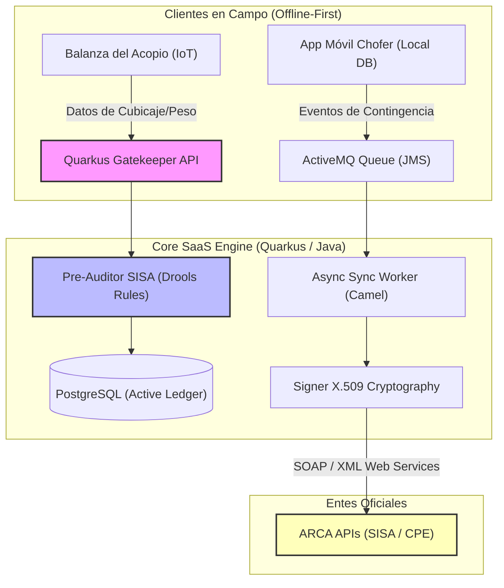

# SISA Shield SaaS (Pre-auditoría y Amortiguador Logístico de Cartas de Porte)

- **Fricción Monetizable:** La **Resolución General Conjunta ARCA 5821/2026** ató la emisión de la **Carta de Porte Electrónica (CPE)** de forma estricta al estatus en tiempo real en el **SISA**. Si hay discrepancias de stock teórico de granos ante ARCA, la emisión se bloquea automáticamente y el camión queda varado en el lote agrícola o en la ruta. Un día de retraso por camión cuesta cientos de dólares en flete inútil y penalizaciones logísticas. Además, registrar contingencias (roturas mecánicas, cambios de chofer en ruta) requiere clave fiscal y conectividad, algo casi inexistente en los lotes de la zona núcleo.

- **Moat Técnico:**
    - **Offline-First local en el celular del chofer:** Un cliente nativo liviano que registre las coordenadas GPS y fotos de la contingencia en tránsito (ej. neumático reventado) localmente, firmando digitalmente el evento.
    - **Spring Boot/Quarkus Gatekeeper con Drools Engine:** Un motor de reglas de negocio en Java que replique localmente los algoritmos de validación de stock y estatus fiscal de ARCA, permitiendo una "pre-auditoría" del camión *antes* de iniciar la carga.
    - **Sincronizador Asíncrona y Tolerante a Fallos:** Encolamiento de eventos de emisión y contingencia utilizando Apache ActiveMQ. Si los servidores de ARCA sufren un Error 503 o hay microcortes de conectividad rural, el sistema reintenta el impacto con estrategias de retroceso exponencial (*exponential backoff*).

### Esquema de Arquitectura

- **Análisis Escéptico:**
    1. **¿Es un problema de hoy?** Sí, el endurecimiento logístico tras la eliminación del RUCA y el monopolio de control de SISA en 2026 ha vuelto los despachos sumamente rígidos.
    2. **¿Pagarían por ello?** Los acopios y mega-productores pagarían una suscripción SaaS premium porque el costo de tener 5 camiones varados en banquina supera el valor de la licencia anual. Venden *garantía de tránsito*.
    3. **Moat de 3 Miopes:** La implementación de firmas digitales X.509 mediante keystores de Java, serialización XML para web services SOAP estatales y el manejo tolerante a fallos con colas transaccionales JMS no es algo que un equipo junior pueda improvisar en semanas con plantillas web tradicionales.
    4. **Fricción de salida:** La base de datos guarda el histórico de cubicaje real en balanza y pre-auditorías de stock declaradas a SISA. Cambiar de proveedor de software implica perder la conciliación histórica y arriesgar auditorías cruzadas ante ARCA.
    5. **Escalabilidad:** Altamente replicable en cadenas de valor agrícola de otros países de Latinoamérica (como Brasil con su factura electrónica de transporte) que copian el modelo fiscal argentino.

## Backlinks
*   Ver contexto regulatorio en [[Resolucion_ARCA_CPE]]
*   Ver fricción de transporte en [[Friccion Logistica Exportadora]]
